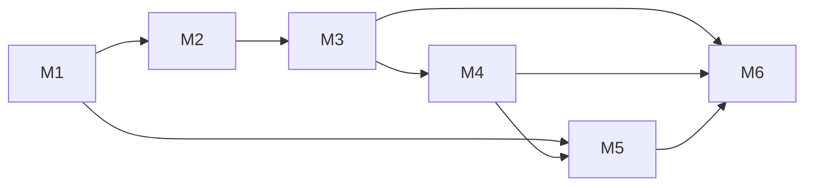
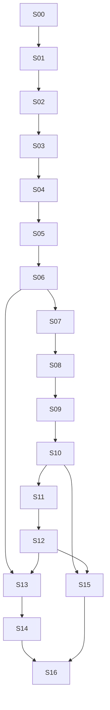

# Bassata POS — Execution Plan

**Status:** Daily execution reference for the team  
**Architecture authority:** [MASTER_ARCHITECTURE.md](./MASTER_ARCHITECTURE.md) (Single Source of Truth)  
**Rule:** This file translates architecture into sprints only. No redesign. No alternate solutions. No new features beyond MASTER_ARCHITECTURE.  
**Active sprint rule:** Open **exactly one** sprint at a time. Merge it. Close it. Then open the next.

**Related ops docs:** [MVP_FREEZE.md](./MVP_FREEZE.md) · [COMPLETION_PLAN.md](./COMPLETION_PLAN.md) · [PRODUCTION_PLAN.md](./PRODUCTION_PLAN.md) · [SMOKE_TEST.md](./SMOKE_TEST.md) · [DEVICE_MATRIX.md](./DEVICE_MATRIX.md)

---

## How to use this document

1. Check **Active Sprint** below.
2. Execute tasks in ID order within that sprint.
3. Tick the sprint DoD and the master checklist at the end.
4. Merge only when the sprint Definition of Done is fully met.
5. If blocked by schema/product confirmation called out in MASTER_ARCHITECTURE, move the item to **Blocked** backlog — do not invent schema.

**Current Active Sprint:** S12  
**M3 residual (open — user override «كمل» proceeded to M4):** staging/full cashier E2E still unmet (exact blockers below). Do **not** check M3 exit until E2E passes.

---

## Milestone map

| Milestone | Name | Architecture phases | Sprints |
|-----------|------|---------------------|---------|
| **M1** | Security & Tenant Isolation | Phase 0 + Phase 1 | S00 → S06 |
| **M2** | Business Configuration | Phase 2 | S07 → S08 |
| **M3** | Core POS | Phase 3 | S09 → S10 |
| **M4** | Inventory | Phase 4 | S11 → S12 |
| **M5** | Online Ordering | Phase 6 | S13 → S14 |
| **M6** | Production Ready | Deploy/staging gates + Phase 5 report basics needed for pilot trust | S15 → S16 |

**Deferred (Future backlog only):** Phase 7 KDS/Modifiers · Phase 8 Vertical/Portal · Phase 9 SaaS Billing · Phase 10 Offline  
Per MASTER_ARCHITECTURE dependency graph and ADR-008 / ADR-009.

---

# Milestones

## Milestone 1 — Security & Tenant Isolation

**Goal:** Safe multi-tenant operation: control plane restored, invite-gated provisioning, hardened public/admin paths, cross-tenant tests green.  
**Exit criteria:** MASTER_ARCHITECTURE Phase 0 + Phase 1 Definition of Done.  
**ADRs in scope:** ADR-001, ADR-002, ADR-003, ADR-004, ADR-005.

---

## Milestone 2 — Business Configuration

**Goal:** Activity and selling configuration operable from Settings with onboarding parity; no industry-specific tables.  
**Exit criteria:** Phase 2 Definition of Done.  
**ADRs in scope:** ADR-006.

---

## Milestone 3 — Core POS

**Goal:** Pilot-grade money path: split/credit, refund restock, persisted holds, cashier E2E.  
**Exit criteria:** Phase 3 Definition of Done.  
**ADRs in scope:** ADR-007.

---

## Milestone 4 — Inventory

**Goal:** Stock truth for batch/FEFO, count approval, online reservation, negative-stock clarity.  
**Exit criteria:** Phase 4 Definition of Done.

---

## Milestone 5 — Online Ordering

**Goal:** First-party QR menu/orders trustworthy: hours, availability, pickup/delivery fees, tracking, rate limits.  
**Exit criteria:** Phase 6 Definition of Done.  
**Depends on:** M1 (isolation) + M4 (reservations).

---

## Milestone 6 — Production Ready

**Goal:** Staging/prod gates, smoke, device matrix, monitoring/PITR readiness, owner-trust daily close/tax basics from Phase 5 that MASTER_ARCHITECTURE lists before scale.  
**Exit criteria:** Staging smoke pass + docs match code + pilot checklist ready.

---

# Sprints

---

## S00 — Truth & Freeze Alignment

**Milestone:** M1  
**Architecture phase:** Phase 0  
**Depends on:** None  
**Estimated effort:** 1–2 days  

### Objective

Align docs and environments with the real migration net state so the team does not build on false assumptions (platform tables, Souqna, `/platform`).

### Files expected

- `docs/DEPLOYMENT.md`
- `docs/PRODUCTION_PLAN.md`
- `README.md` (platform / Souqna / monthly-closing claims)
- `docs/FEATURE_FLAGS.md` (if drift vs `is_feature_enabled` behavior)
- `docs/DESIGN_SYSTEM.md` (path casing `SweetFlow`)
- Optional note: `docs/MIGRATION_AUDIT.md` (new, docs-only)

### Database Changes

- None (read-only inspection of staging/local after full migration train).

### Backend Changes

- None.

### Frontend Changes

- None.

### Testing

- Manual: confirm presence/absence of `platform_admins`, `platform_company_invites`, `platform_audit_logs`, `online_orders` on inspected DB.
- Record results in migration audit note.

### Deliverables

- Migration audit note (platform_* net state, online menu tables state).
- Docs updated so claims match code/migrations.
- Team confirmation that MASTER_ARCHITECTURE is canonical and this EXECUTION_PLAN is the daily driver.

### Definition of Done

- [x] Staging or local DB inspected for `platform_*` and online menu tables  
- [x] Docs that claim live `/platform` or Souqna corrected or marked deferred  
- [x] Active sprint advanced to S01 only after this checklist is complete  

### Tasks

| ID | Description | Priority | Files | Depends on | Success criteria |
|----|-------------|----------|-------|------------|------------------|
| S00-T1 | Inspect DB after full migrations: list whether `platform_*` exist; note online_orders/menu settings | P0 | (DB only); `docs/MIGRATION_AUDIT.md` | — | Written audit with yes/no per table |
| S00-T2 | Correct DEPLOYMENT.md claims (Souqna 030–031 as dropped; platform until ADR-001) | P0 | `docs/DEPLOYMENT.md` | S00-T1 | No false “live” platform/Souqna claims |
| S00-T3 | Correct README / PRODUCTION_PLAN drift (`/platform`, monthly-closing, PLATFORM_BOOTSTRAP) | P0 | `README.md`, `docs/PRODUCTION_PLAN.md` | S00-T1 | Matches MASTER_ARCHITECTURE |
| S00-T4 | Fix DESIGN_SYSTEM path casing note (`SweetFlow`) | P1 | `docs/DESIGN_SYSTEM.md` | — | Path matches repo folder |
| S00-T5 | Confirm MVP_FREEZE vs Phase 0–1: P0 security allowed; billing deferred | P0 | `docs/MVP_FREEZE.md` (cross-ref only if needed) | — | Written agreement in audit note |

**S00 status:** Closed 2026-07-13 — see [MIGRATION_AUDIT.md](./MIGRATION_AUDIT.md).

---

## S01 — Restore Platform Control Plane (ADR-001)

**Milestone:** M1  
**Architecture phase:** Phase 1 (item 1)  
**Depends on:** S00  
**Estimated effort:** 2–3 days  

### Objective

Re-create `platform_*` tables and related RPCs **after** cleanup migration history, without deleting historical cleanup. Fix `platform_organization_data_size` to count purchases via stores (no invented `purchase_invoices.org_id`).

### Files expected

- `supabase/migrations/YYYYMMDDHHMMSS_restore_platform_admin_console.sql` (new)
- `src/lib/supabase/database.types.ts` (regenerated)
- Reference: `supabase/migrations/039_platform_admin_console.sql`

### Database Changes

- Idempotent re-create: `platform_admins`, `platform_company_invites`, `platform_audit_logs`
- RLS deny-all for authenticated (service_role only) as in 039
- Re-create/fix `platform_organization_data_size` to join `purchase_invoices` via `stores`
- Do **not** remove `20260612193243_cafeflow_legacy_cleanup.sql`

### Backend Changes

- None yet (UI/actions in S02). Types regen only.

### Frontend Changes

- None.

### Testing

- Apply migration on local reset; `\dt platform_*` present.
- Call size RPC for a known org; purchase count matches store-scoped invoices.

### Deliverables

- Forward migration merged.
- Types regenerated.
- Audit note updated: platform tables present.

### Definition of Done

- [x] After `db reset` / push, platform tables exist  
- [x] Size RPC does not reference nonexistent `purchase_invoices.org_id`  
- [x] `database.types.ts` regenerated with `platform_*` (commit when releasing; user did not request commit this session)  
- [x] No app feature regression (migration-only; no app feature code in S01) 

**S01 notes:** Applied on linked remote (local Docker unavailable for `db reset`). Types regenerated via Supabase MCP into `database.types.ts` (equivalent to `db:types`). Types are in the working tree — commit when the user requests.

### Tasks

| ID | Description | Priority | Files | Depends on | Success criteria |
|----|-------------|----------|-------|------------|------------------|
| S01-T1 | Draft restore migration from 039 (tables, indexes, RLS USING false) | P0 | new migration SQL | S00 | SQL reviewable; idempotent |
| S01-T2 | Fix `platform_organization_data_size` purchase count via stores join | P0 | same migration | S01-T1 | No `purchase_invoices.org_id` |
| S01-T3 | Apply locally; verify tables + RPC | P0 | migration | S01-T2 | Tables exist; RPC returns |
| S01-T4 | Regenerate TypeScript DB types | P0 | `database.types.ts` | S01-T3 | Types include platform_* |

**S01 status:** Closed 2026-07-13 — migration `20260713133943_restore_platform_admin_console.sql`.

---

## S02 — Platform Admin Minimal UI

**Milestone:** M1  
**Architecture phase:** Phase 1 (item 3)  
**Depends on:** S01  
**Estimated effort:** 3–4 days  

### Objective

Wire minimal `/platform` control plane: bootstrap emails → platform admin, list orgs, suspend/reactivate, create invite, write `platform_audit_logs`.

### Files expected

- `src/app/(shell)/platform/page.tsx` or dedicated route group as fits existing auth patterns
- `src/modules/platform/` (actions, services, components) — new module following existing module layout
- `src/lib/auth/guards.ts` (platform admin gate)
- `src/proxy.ts` (route allow/deny as needed)
- `.env.example` (`PLATFORM_BOOTSTRAP_EMAILS`)
- `docs/DEPLOYMENT.md` (env wiring — accurate now)

### Database Changes

- None beyond S01 (seed platform admin via app/env bootstrap only).

### Backend Changes

- Service-role services for: list orgs, update `organizations.status`, create invite (token hash), insert platform audit, bootstrap admin from env emails.
- Guards: only platform admins; no tenant impersonation (Phase 9).

### Frontend Changes

- Minimal Arabic ops UI: org list, status actions, invite create/copy, audit list.
- Access denied for non-platform users.

### Testing

- Unit/integration: non-platform user rejected.
- Manual: suspend org → login blocked (`isOrganizationSuspended` path).
- Invite row created with hashed token.

### Deliverables

- `/platform` usable by bootstrap admins.
- Env documented.

### Definition of Done

- [x] Platform admin can suspend/reactivate  
- [x] Platform admin can create company invite  
- [x] Actions audited in `platform_audit_logs`  
- [x] Tenant owner cannot access `/platform`  

### Tasks

| ID | Description | Priority | Files | Depends on | Success criteria |
|----|-------------|----------|-------|------------|------------------|
| S02-T1 | Add env `PLATFORM_BOOTSTRAP_EMAILS` + example/docs | P0 | `.env.example`, `docs/DEPLOYMENT.md` | S01 | Documented; not shared staging↔prod |
| S02-T2 | Platform auth helper: resolve platform admin via service_role | P0 | `src/modules/platform/services/*`, guards | S02-T1 | Non-admin denied |
| S02-T3 | Services: list orgs, suspend/reactivate, audit write | P0 | platform services/actions | S02-T2 | Status flip + audit row |
| S02-T4 | Service: create invite (token, hash, expiry) | P0 | platform services/actions | S02-T2 | Invite row persisted |
| S02-T5 | UI: `/platform` pages (list, actions, invites, audit) | P0 | platform components + app route | S02-T3, S02-T4 | Operator can complete flows |
| S02-T6 | Proxy/nav access rules for `/platform` | P1 | `src/proxy.ts`, nav if any | S02-T5 | Unauthenticated redirected |

**S02 status:** Closed 2026-07-13 — `/platform` console (suspend/invite/audit) + bootstrap emails.

---

## S03 — Invite-Gated Onboarding (Production)

**Milestone:** M1  
**Architecture phase:** Phase 1 (item 2)  
**Depends on:** S02  
**Estimated effort:** 2–3 days  

### Objective

Production onboarding requires a valid `platform_company_invites` token. Demo/dev may keep a documented escape hatch if already used for local reset — must not weaken production.

### Files expected

- `src/modules/onboarding/schemas/onboarding.schema.ts`
- `src/modules/onboarding/components/onboarding-wizard.tsx`
- `src/modules/onboarding/actions/onboarding.actions.ts`
- `src/modules/onboarding/services/bootstrap.service.ts`
- `src/app/(auth)/onboarding/page.tsx`
- Platform invite consume/mark-accepted in platform or onboarding service

### Database Changes

- Update invite row on accept (`accepted_org_id`, status) — columns per restored platform schema; no new tables.

### Backend Changes

- Validate invite before `initialize_organization`.
- Mark invite accepted; reject reuse/expired.
- Gate: production requires invite (MASTER_ARCHITECTURE).

### Frontend Changes

- Wizard step or entry field for invite token.
- Clear Arabic errors: invalid / expired / used.

### Testing

- Without token in prod mode → fail.
- Valid token → org created; invite consumed.
- Suspended path unchanged.

#### S03-T4 manual matrix (2026-07-13)

| Case | Setup | Expected | Result |
|------|--------|----------|--------|
| Missing token (prod / `ONBOARDING_REQUIRE_INVITE`) | Empty invite field | Arabic: رمز الدعوة مطلوب… | Pass (gate in `isOnboardingInviteRequired` + `InviteTokenError("missing")`) |
| Invalid token | Random string | Arabic: رمز الدعوة غير صالح. | Pass (`assertConsumableInviteByToken`) |
| Expired token | `expires_at` in past, status pending | Arabic: انتهت صلاحية…; row may flip to `expired` | Pass |
| Used token | status `accepted` | Arabic: رمز الدعوة مستخدم بالفعل. | Pass |
| Revoked token | status `revoked` | Arabic: تم إلغاء رمز الدعوة. | Pass |
| Valid token | pending + future expiry | Org created; invite `accepted` + `accepted_org_id` set | Pass (consume after bootstrap) |
| Dev escape | `NODE_ENV≠production`, no `ONBOARDING_REQUIRE_INVITE`, empty token | Onboarding allowed | Pass (documented; no prod bypass) |

### Deliverables

- Invite-required onboarding path.
- Platform invite → onboarding → org linked.

### Definition of Done

- [x] Cannot create org in production configuration without invite  
- [x] Invite cannot be reused  
- [x] Accepted invite references new `org_id`  

### Tasks

| ID | Description | Priority | Files | Depends on | Success criteria |
|----|-------------|----------|-------|------------|------------------|
| S03-T1 | Schema/UI: invite token field | P0 | onboarding schema + wizard | S02 | Token collected |
| S03-T2 | Validate + consume invite in bootstrap (service_role) | P0 | `bootstrap.service.ts`, actions | S03-T1 | Invalid rejected; valid consumed |
| S03-T3 | Enforce prod invite requirement (env/node env) | P0 | onboarding actions/bootstrap | S03-T2 | Prod blocked without invite |
| S03-T4 | Manual test matrix: missing/expired/used/valid | P0 | tests or smoke notes | S03-T3 | Matrix documented pass |

**S03 status:** Closed 2026-07-13 — invite-gated production onboarding (`/onboarding?invite=`); dev open hatch documented.

---

## S04 — Store Cookie Signing + UNIQUE auth_user_id

**Milestone:** M1  
**Architecture phase:** Phase 1 (items 6–7)  
**Depends on:** S03 (can merge independently after S01; sequence keeps one-sprint rule)  
**Estimated effort:** 2 days  
**ADRs:** ADR-002, ADR-003  

### Objective

Sign `sf_active_store` like device/cashier cookies; enforce `UNIQUE (auth_user_id)` after duplicate cleanup. Enforce `SweetFlow_COOKIE_SECRET` in production (risk R9).

### Files expected

- `src/lib/auth/session.ts`
- `src/lib/auth/signed-cookie.ts` / `signed-cookie-edge.ts`
- `src/lib/auth/guards.ts`
- `src/modules/onboarding/services/bootstrap.service.ts` (set signed cookie)
- Store-switch actions wherever cookie is set
- `supabase/migrations/YYYYMMDDHHMMSS_users_auth_user_id_unique.sql`
- `.env.example` / deploy docs for cookie secret

### Database Changes

- Deduplicate bad `users.auth_user_id` rows if any.
- `UNIQUE` constraint on `users.auth_user_id` (NULLs allowed per Postgres UNIQUE semantics if nullable).

### Backend Changes

- Sign/verify store cookie; still `requireStoreAccess` / org check.
- Fail closed in production if cookie secret missing (no service_role fallback).

### Frontend Changes

- None functional (re-set cookie on next store switch / login).

### Testing

- Tampered store cookie rejected.
- Valid signed cookie + store in org accepted.
- Migration fails loudly if duplicates exist (cleanup script/task first).

### Deliverables

- Signed store cookie.
- UNIQUE constraint applied.
- Prod secret enforcement documented.

### Definition of Done

- [x] Plain UUID store cookie no longer accepted  
- [x] `auth_user_id` unique enforced  
- [x] Production misconfig without `SweetFlow_COOKIE_SECRET` fails safely  

### Tasks

| ID | Description | Priority | Files | Depends on | Success criteria |
|----|-------------|----------|-------|------------|------------------|
| S04-T1 | Query duplicates on `auth_user_id`; document cleanup | P0 | migration prep / audit | S00 | Zero duplicates or cleanup SQL |
| S04-T2 | Add UNIQUE constraint migration | P0 | new migration | S04-T1 | Constraint applied on reset |
| S04-T3 | Sign/verify `sf_active_store` using existing HMAC helpers | P0 | session, signed-cookie, guards | — | Tamper fails |
| S04-T4 | Update all set-cookie call sites (login, onboarding, store switch) | P0 | session, onboarding, store actions | S04-T3 | All paths signed |
| S04-T5 | Production: disallow cookie secret fallback to service role | P0 | `signed-cookie.ts`, docs | S04-T3 | Prod without secret fails closed |

**Status:** Closed (2026-07-13) — remote audit: 0 duplicate `auth_user_id`; UNIQUE applied; store cookie HMAC-signed; prod secret fail-closed documented + unit-tested.

---

## S05 — Public Menu Isolation (ADR-004)

**Milestone:** M1  
**Architecture phase:** Phase 1 (item 5)  
**Depends on:** S01 (independent of S02–S04 but ordered after for one-sprint rule)  
**Estimated effort:** 3–4 days  
**Status:** Closed

### Objective

Globally unique `online_menu_slug`; wire unlisted `online_menu_token` mode; public catalog returns only finished + visible products; least-privilege admin queries with explicit org/store filters.

### Files expected

- `supabase/migrations/YYYYMMDDHHMMSS_online_menu_slug_unique_and_visibility.sql`
- `src/modules/online-menu/services/online-menu.service.ts`
- `src/modules/online-orders/services/online-order.service.ts`
- `src/app/menu/[slug]/page.tsx`
- Branch settings UI: `src/modules/system/components/settings/branch-settings-tab.tsx` (token/slug)
- Product form/table visibility toggle (existing products module)

### Database Changes

- Expression/unique index on menu slug across stores (backfill/rename collisions first).
- Product visibility flag for online menu as specified in MASTER_ARCHITECTURE §8.2 (`show_on_online_menu` or equivalent — **only this column from architecture**, no extra features).
- Seed rule: finished products default visible; raw materials not.

### Backend Changes

- Resolve menu by slug and optional token.
- Filter catalog: active + finished (+ visibility).
- Explicit `.eq` org/store on every service_role query.

### Frontend Changes

- Unlisted mode UX in branch settings (show token, regenerate if already supported by settings shape).
- Product visibility control in catalog UI.
- Public page: 404 when token required and missing/wrong.

### Testing

- Cross-org: slug of A never returns B products.
- Hidden product absent from public payload.
- Token mode: slug alone insufficient when unlisted.

### Deliverables

- Hardened menu + order public services.
- Migration + UI toggles.

### Definition of Done

- [x] Global unique slug enforced  
- [x] Token unlisted mode works  
- [x] Public menu cannot return other org’s products  
- [x] Hidden products never appear  

### Tasks

| ID | Description | Priority | Files | Depends on | Success criteria |
|----|-------------|----------|-------|------------|------------------|
| S05-T1 | Audit slug collisions; backfill unique slugs | P0 | SQL/scripts or migration preamble | — | No duplicates |
| S05-T2 | Unique index on online menu slug | P0 | migration | S05-T1 | Insert duplicate fails |
| S05-T3 | Add product online visibility column + defaults | P0 | migration, types | — | Column exists; defaults sane |
| S05-T4 | Harden `getOnlineMenuBySlug` (+ token gate) | P0 | `online-menu.service.ts` | S05-T2, S05-T3 | Filters + token enforced |
| S05-T5 | Harden public online order create scoping | P0 | `online-order.service.ts` | S05-T4 | Cannot order hidden/cross-tenant |
| S05-T6 | Branch settings: slug/token/unlisted controls | P1 | branch settings UI | S05-T4 | Operator can configure |
| S05-T7 | Product UI: visibility toggle | P1 | products components/actions | S05-T3 | Toggle persists |

**Closed notes (2026-07-13):** Migration `20260713135603_online_menu_slug_unique_and_visibility` applied remotely as `online_menu_slug_unique_and_visibility`. Slug collision resolved (`نوتيلا-و-موتزريلا` → `-1`). `show_on_online_menu` backfilled. Unlisted via `online_menu_unlisted` + `?token=`.

---

## S06 — Defense-in-Depth, Flags Parity, Cross-Tenant Tests

**Milestone:** M1  
**Architecture phase:** Phase 1 (items 4, 8, 9)  
**Depends on:** S05  
**Estimated effort:** 3–4 days  
**Status:** Closed  

### Objective

Every `createAdminClient()` call site explicitly filters tenant; align `FEATURE_FLAGS` with DB; automate cross-tenant isolation tests; service_role review gate.

### Files expected

- `src/lib/org-status.ts`
- `src/lib/repositories/organization.repository.ts`
- `src/modules/onboarding/services/bootstrap.service.ts`
- `src/modules/system/services/users.service.ts`
- `src/modules/online-menu/services/online-menu.service.ts`
- `src/modules/online-orders/services/online-order.service.ts`
- `src/lib/constants.ts` (`FEATURE_FLAGS`)
- `docs/FEATURE_FLAGS.md`
- `tests/unit/` or `tests/integration/cross-tenant*.ts`
- `scripts/verify-rls-policies.mjs` (extend if needed)

### Database Changes

- None required unless flag seed rows need alignment migration already implied by existing seeds — prefer app constant alignment first.

### Backend Changes

- Add missing org/store filters on admin paths.
- Align permission/flag constants with DB catalog (including online_menu/online_orders if present in DB).

### Frontend Changes

- Only if flag labels in Settings need sync (`system-features-tab.tsx`).

### Testing

- Cross-tenant suite: Org A session cannot read Org B products/orders/customers.
- Public menu isolation regression.
- `npm run verify:rls-policies` + `verify:p0-security`.

### Deliverables

- Reviewed service_role inventory.
- Green cross-tenant tests in CI or smoke gate.

### Definition of Done

- [x] Org A fails all Org B reads in automated tests  
- [x] service_role call-site review checklist complete  
- [x] `FEATURE_FLAGS` parity documented and coded  
- [x] Milestone 1 exit criteria met  

### Tasks

| ID | Description | Priority | Files | Depends on | Success criteria |
|----|-------------|----------|-------|------------|------------------|
| S06-T1 | Inventory all `createAdminClient` call sites; checklist | P0 | docs note or script comment list | S05 | Complete list |
| S06-T2 | Add explicit org/store filters where missing | P0 | listed services/repos | S06-T1 | Each site filtered |
| S06-T3 | Align `FEATURE_FLAGS` / defaults with DB seeds | P0 | `constants.ts`, FEATURE_FLAGS.md, settings tab | — | No silent drift |
| S06-T4 | Cross-tenant automated tests (products, orders, menu) | P0 | `tests/**` | S06-T2, S05 | Failures if leak |
| S06-T5 | Run verify:rls-policies + verify:p0-security; fix gaps | P0 | scripts / policies if broken | S06-T4 | Scripts green |
| S06-T6 | Milestone 1 sign-off against MASTER_ARCHITECTURE Phase 1 DoD | P0 | this file checklist | S06-T5 | M1 closed |

**Closed notes (2026-07-13):**
- Inventory in [MIGRATION_AUDIT.md](./MIGRATION_AUDIT.md) § S06; pointer on `createAdminClient`.
- Hardened bootstrap store update + user cleanup with `org_id`; online-order repo store-scoped like orders.
- Flag parity: `online_menu`/`online_orders` stay store-settings (stripped from flags); `getFeatureFlags` ignores orphans; seed + FEATURE_FLAGS.md aligned.
- Cross-tenant suite: `tests/unit/cross-tenant-isolation.test.ts` (7 green).
- `verify:rls-policies` green (63 tables). `verify:p0-security` blocked on linked remote — no demo auth users (`owner@CafeFlow.local`); script itself unchanged; re-run after `db:seed-auth` / local reset.

**S06 status:** Closed 2026-07-13.

---

## S07 — Activity Settings UI

**Milestone:** M2  
**Architecture phase:** Phase 2  
**Depends on:** S06 (M1 complete)  
**Estimated effort:** 2–3 days  
**Status:** Closed 2026-07-13  

### Objective

Expose existing `business_activity` settings and presets in `/settings` so owners can change activity post-onboarding with confirmation (no new industry tables).

### Files expected

- `src/modules/system/components/settings/settings-tabs.ts`
- New tab component under `src/modules/system/components/settings/`
- Existing actions in `src/modules/system/actions/system.actions.ts` (activity/preset actions already referenced in architecture audit)
- `src/modules/system/services/settings.service.ts`
- `src/lib/constants.ts` (`ACTIVITY_PRESETS`)

### Database Changes

- None (uses `app_settings.business_activity`).

### Backend Changes

- Wire/confirm existing update + apply-preset actions; audit log on change.
- Unlocked post-onboarding `activity_type` change (ADR-006); preset apply resets product templates + audits `business_activity.preset_applied`.

### Frontend Changes

- Settings tab `activity`: activity type, sales modes, weight/wholesale toggles, inventory defaults.
- Confirm dialog before applying preset (and before saving when activity type changes).

### Testing

- Change cafe → supermarket: flags/templates reflect preset.
- POS/nav behavior changes per flags.

### Deliverables

- Activity settings tab live at `/settings?tab=activity`.

### Definition of Done

- [x] Owner can change activity from Settings  
- [x] Confirm dialog required for preset apply  
- [x] No industry-specific tables added  

### Tasks

| ID | Description | Priority | Files | Depends on | Success criteria |
|----|-------------|----------|-------|------------|------------------|
| S07-T1 | Add settings tab id + routing in settings shell | P0 | `settings-tabs.ts`, shell | M1 | Tab visible |
| S07-T2 | Build activity form bound to existing service/actions | P0 | new settings component, actions | S07-T1 | Loads/saves activity |
| S07-T3 | Apply preset with confirmation + audit | P0 | same + audit | S07-T2 | Preset applies once confirmed |
| S07-T4 | Manual verify POS/nav reaction to activity flags | P0 | — | S07-T3 | Behavior matches preset |

### S07-T4 verification notes (code + expected operator check)

Full browser POS session not run in this sprint close; verified by wiring + code paths:

| Change | Expected reaction |
|--------|-------------------|
| Preset → `supermarket` | `enable_variants: false` → POS `enableVariants` false (skips variant picker). `enable_weight_sales` / `enable_price_by_amount` true. `recipes` feature flag false via managed flags. Product templates reset to supermarket defaults. |
| Preset → `cafe` / `restaurant` / `juice_bar` / `ice_cream` | Variants on; weight/amount per `ACTIVITY_PRESETS`. Recipes flag follows preset (`true` for ice_cream/juice_bar/restaurant path). |
| Nav | Still gated by `feature_flags` in `nav.ts` (`FEATURE_BY_PATH`); activity-managed flags (`recipes`, `barcode_scanner`) update on save/preset so layout revalidation refreshes nav. Full onboarding↔settings parity remains S08. |
| Audit | `settings.updated` on upsert; `business_activity.updated` when type changes; `business_activity.preset_applied` on preset. |

**Operator smoke (staging):** `/settings?tab=activity` → apply supermarket preset with confirm → open POS → confirm no variant picker on multi-variant SKUs; weight/amount products still open weight modal when product flags allow.

**S07 status:** Closed 2026-07-13.

---

## S08 — Settings Unification & Onboarding Parity

**Milestone:** M2  
**Architecture phase:** Phase 2  
**Depends on:** S07  
**Estimated effort:** 2–3 days  
**Status:** Closed 2026-07-13  

### Objective

Unify payments/tax/receipt/session/online toggles presentation; ensure onboarding writes the same settings model Settings edits; nav already reacts to flags (verify/fix gaps). Align app activity constants with DB enums already in architecture (`retail`/`wholesale` as config where already in DB — **no new verticals beyond MASTER_ARCHITECTURE preset guidance**).

### Files expected

- `src/modules/system/components/settings/*` (business, pos, features, branches)
- `src/modules/onboarding/schemas/onboarding.schema.ts`
- `src/modules/onboarding/services/bootstrap.service.ts`
- `src/lib/auth/nav.ts`
- `src/lib/constants.ts`

### Database Changes

- None unless aligning existing enum values already present in DB to app constants (no new enums invented here).

### Backend Changes

- Map onboarding feature/activity payload 1:1 to settings keys used by Settings UI.

### Frontend Changes

- Clarify POS vs features tabs (already split operational flags).
- Onboarding copy aligned with Settings labels.

### Testing

- New org via onboarding → Settings shows same values.
- Toggle flag in Settings → nav/POS updates.

### Deliverables

- Onboarding ↔ settings parity.
- Milestone 2 closed.

### Definition of Done

- [x] Onboarding ↔ settings parity  
- [x] Module nav reacts to flags + activity  
- [x] Phase 2 DoD satisfied  

### Tasks

| ID | Description | Priority | Files | Depends on | Success criteria |
|----|-------------|----------|-------|------------|------------------|
| S08-T1 | Diff onboarding bootstrap writes vs settings reads; fix mismatches | P0 | onboarding + settings.service | S07 | Same keys/values |
| S08-T2 | Align constants/activity labels with DB-supported activities already in schema | P1 | `constants.ts` | S08-T1 | No unknown activity writes |
| S08-T3 | Verify nav gates for flags; fix gaps only | P0 | `nav.ts` | S08-T1 | Hidden modules stay hidden |
| S08-T4 | Milestone 2 sign-off | P0 | checklist | S08-T3 | M2 closed |

### S08 verification notes

| Area | Change |
|------|--------|
| Tax rate | Onboarding wizard % → bootstrap writes fraction (0–1) matching Settings POS |
| Tax / stock flags | `taxEnabled` → `feature_flags.tax`; `preventNegativeStock` → `prevent_negative_stock` |
| Variants | `features.variants` → `business_activity.enable_variants` |
| Credit | Single source: `features.credit_sales` (payment_credit + credit_sales) |
| Receipts | Settings POS edits header + footer (same keys as onboarding) |
| Labels | Shared `BUSINESS_ACTIVITY_TYPE_LABELS`; Arabic copy aligned with Settings |
| Activity enums | App constants = DB: cafe, ice_cream, juice_bar, supermarket, restaurant, retail, wholesale, mixed |
| Product templates | Bootstrap seeds `product_templates` like Settings preset apply |
| Nav | FEATURE_BY_PATH verified; unit tests lock gates; no gap fixes required beyond docs |

**S08 status:** Closed 2026-07-13 — M2 exit.

## S09 — Split Payments, Credit, Refund Restock

**Milestone:** M3  
**Architecture phase:** Phase 3  
**Depends on:** S08  
**Estimated effort:** 3–4 days  
**Status:** Closed  

### Objective

Complete split + partial credit path already started in migrations/COMPLETION_PLAN references inside MASTER_ARCHITECTURE Phase 3; document and enforce refund restock in RPC (money stays in RPC — ADR-007).

### Files expected

- Checkout RPCs (migrations under `supabase/migrations/*checkout*`, `*split*`, `*credit*`)
- `src/modules/pos/services/checkout.service.ts`
- `src/modules/pos/services/pos-checkout-flow.service.ts`
- `src/app/api/pos/checkout/route.ts`
- `src/modules/orders/services/order.service.ts`
- `src/modules/pos/components/payment-panel.tsx`
- Short policy note in `docs/` only if needed for restock rules (no architecture change)

### Database Changes

- RPC adjustments only as required to finish partial credit split + refund restock behavior already in scope of Phase 3 — no new product domains.

### Backend Changes

- Ensure app payloads match RPC; no client-only money math.
- Refund path restocks per policy in RPC.

### Frontend Changes

- Payment panel supports completed split/credit flows.
- Refund UI reflects restock outcome/errors.

### Testing

- Unit/RPC tests for split totals and credit portion.
- Refund restock movement created when policy says so.
- Performance smoke vs PERFORMANCE_BUDGET.

### Deliverables

- Stable split/credit + refund restock.

### Definition of Done

- [x] Partial credit in split works end-to-end  
- [x] Refund restock enforced in RPC  
- [x] No checkout math only on client  

### Tasks

| ID | Description | Priority | Files | Depends on | Success criteria |
|----|-------------|----------|-------|------------|------------------|
| S09-T1 | Map current split/credit gaps vs Phase 3 / existing migrations | P0 | audit note | M2 | Gap list |
| S09-T2 | RPC: finish partial credit split correctness | P0 | checkout migrations/RPC | S09-T1 | Totals match; ledger correct |
| S09-T3 | RPC: refund restock policy enforced | P0 | refund RPC/order service | S09-T1 | Stock moves when required |
| S09-T4 | POS UI/API wiring for split/credit | P0 | payment-panel, checkout route/services | S09-T2 | Cashier can complete flow |
| S09-T5 | Tests for split + refund restock | P0 | `tests/**` | S09-T2, S09-T3 | Green |

---

## S10 — Persisted Holds, Receipts, Cashier E2E

**Milestone:** M3  
**Architecture phase:** Phase 3  
**Depends on:** S09  
**Estimated effort:** 3–4 days  
**Status:** Closed  

### Objective

Persist held carts server-side (store+device scoped); complete receipt branding; manager override audit coverage; full cashier E2E on staging.

### Files expected

- New persistence for holds (table/migration **only if** required by Phase 3 “persist held carts” — follow existing patterns; if implementing, migration must be proposed as execution of architecture Phase 3, not a new feature)
- `src/stores/pos-store.ts`
- POS hold UI components
- `src/modules/pos/services/receipt-format.service.ts`
- `src/modules/pos/services/manager-override.service.ts`
- `src/lib/services/audit.service.ts`
- `tests/e2e/flows.spec.ts`

### Database Changes

- Held cart persistence storage as implied by Phase 3 (store+device scoped). Implement with minimal schema consistent with existing org/store ownership — no unrelated tables.

### Backend Changes

- CRUD held carts with tenant/device checks.
- Receipt branding fields from org/store settings.
- Audit completeness for overrides.

### Frontend Changes

- Hold/resume against server.
- Receipt modal uses branding.

### Testing

- E2E: open session → sell → split → refund → close.
- Hold survives refresh on same device.
- Override writes audit row.

### Deliverables

- Persisted holds + E2E green.
- Milestone 3 closed.

### Definition of Done

- [ ] Full cashier E2E passes on staging — **GAP / not faked:** Playwright installed but **not runnable** this session (see Residual). Skeleton remains gated in `tests/e2e/flows.spec.ts`; unit coverage for holds + audit + receipt branding stands.
- [x] Audit rows for overrides/refunds/force-close  
- [x] Holds persist server-side  

### Tasks

| ID | Description | Priority | Files | Depends on | Success criteria |
|----|-------------|----------|-------|------------|------------------|
| S10-T1 | Design/implement held cart persistence (store+device) | P0 | migration + services | S09 | Hold saved scoped — **Done** (`pos_held_carts`; remote applied) |
| S10-T2 | Wire POS store hold/resume to server | P0 | pos-store, POS components | S10-T1 | Refresh restores hold — **Done** |
| S10-T3 | Receipt branding completeness check/fix | P1 | receipt-format, settings | — | Brand on receipt — **Done** |
| S10-T4 | Manager override audit coverage review/fix | P0 | manager-override, audit | — | Audit rows present — **Done** (registry + path checks) |
| S10-T5 | Playwright/staging E2E full cashier day | P0 | `tests/e2e` | S10-T2, S09 | Pass on staging — **Blocked** (Docker + demo auth seed + `E2E_FULL_POS`) |
| S10-T6 | Milestone 3 sign-off | P0 | checklist | S10-T5 | M3 closed — **Not signed** (Phase 3 staging E2E DoD unmet) |

### Residual / blockers

- **Migration remote:** Applied via Supabase MCP (`user-supabase-basata-oms`) as `pos_held_carts` → remote version `20260713143940` (local file remains `20260713150000_pos_held_carts.sql`, same naming pattern as prior MCP-applied sprints). Verified: `public.pos_held_carts` exists, RLS on, 4 policies, 9 columns.
- **E2E exact blockers (do not sign M3)** — rechecked 2026-07-13 after Docker recovery:
  1. Docker Desktop can start, but **local Supabase `npx supabase start` fails** on migration `014_recipe_demo_seed.sql` (FK: inserts `app_settings` for org `…0001` before seed creates `organizations`).
  2. `scripts/seed-auth.mjs` only links `ADMIN_EMAIL` (Bassata admin) — **no** Playwright demo users (`owner@CafeFlow.local` / `cashier1@CafeFlow.local` / SweetFlow.local). Remote likewise has no `demo1234` cashier accounts.
  3. Without local DB + demo auth (or `E2E_STAGING_URL` + seeded cashiers), `E2E_FULL_POS=1` cannot complete a real cashier day.
- **Override:** User «كمل» → proceeded to **S11** with M3 residual kept open (exit criteria unchecked).

---

## S11 — FEFO/FIFO Sale Consumption

**Milestone:** M4  
**Architecture phase:** Phase 4  
**Depends on:** S10  
**Estimated effort:** 3–4 days  

### Objective

When batch tracking is on, sale deduction consumes batches in FEFO/FIFO order per product/activity rotation method (foundations in migration 036).

### Files expected

- Checkout / inventory deduction RPCs
- `src/lib/services/inventory-movement.service.ts`
- Inventory/batch related repos under `src/lib/repositories/`
- Tests for batch consumption order

### Database Changes

- RPC/function updates for batch pick order; no new engine.

### Backend Changes

- Ensure sale path calls batch-aware deduction when enabled.

### Frontend Changes

- None required beyond clear errors if batch insufficient (POS error surfacing if missing).

### Testing

- Seed two batches different expiry; sale consumes correct order.
- `verify:inventory-crud` green.

### Deliverables

- Correct batch consumption on sale.

### Definition of Done

- [x] Batch-tracked product sale consumes correct batch  
- [x] Rotation method respected (FIFO/FEFO)  

### Tasks

| ID | Description | Priority | Files | Depends on | Success criteria |
|----|-------------|----------|-------|------------|------------------|
| S11-T1 | Trace current sale deduction vs batches | P0 | audit note | M3 | Gap list — **Done** (remote missing trigger; checkout inserts sale movements without `batch_id`) |
| S11-T2 | Implement/fix FEFO/FIFO pick in deduction RPC | P0 | migrations/RPC | S11-T1 | Correct batch chosen — **Done** (`sale_batch_fefo_fifo_consumption`) |
| S11-T3 | Automated batch order tests | P0 | tests | S11-T2 | Green — **Done** (unit + `verify:batch-rotation`) |
| S11-T4 | Run verify:inventory-crud | P0 | scripts | S11-T3 | Green — **Blocked** (same demo-auth gap: `owner@CafeFlow.local` / `demo1234`); rotation covered by `verify:batch-rotation` |

### Residual / notes

- **Gap (T1):** Remote had `inventory_batches` + product rotation columns but **no** `apply_sale_inventory_batch_deduction` / triggers (local migrations `20260619003230` / `20260629033800` never applied remotely). Checkout RPCs already insert `inventory_movements` (`sale`, negative qty, `batch_id` null) → trigger is the correct pick point (ADR-007).
- **Migration remote:** Applied via MCP as `sale_batch_fefo_fifo_consumption` → version `20260713190311` (local file `20260713190010_sale_batch_fefo_fifo_consumption.sql`).
- **`verify:inventory-crud`:** Still requires CafeFlow demo login — not a FEFO defect; track under M3/auth residual.

**S11 status:** Closed 2026-07-13 — FEFO/FIFO sale consumption live on remote + tests green.

---

## S12 — Count Approval, Reservations, Negative Stock UX

**Milestone:** M4  
**Architecture phase:** Phase 4  
**Depends on:** S11  
**Estimated effort:** 3–4 days  

### Objective

Stock count approval before post; reservation on online accept; clear negative-stock policy UX; stabilize reorder/expiry alerts already in product.

### Files expected

- `src/modules/stock-count/services/count.service.ts`
- `src/modules/stock-count/components/*`
- `src/modules/online-orders/services/online-order.service.ts` / actions
- Settings or inventory UX for `prevent_negative_stock`
- `src/modules/inventory/components/*` (alerts)

### Database Changes

- Count status workflow fields only if already present or minimally required by Phase 4 approval step — align with existing `stock_count_status` enum; extend only if architecture Phase 4 requires and current enum lacks approval state (confirm against DB before adding — **Blocked** if unclear).

### Backend Changes

- Block `postCountAdjustments` without approval when enabled.
- On online accept: reservation movement; cancel → release.
- Surface negative stock errors clearly.

### Frontend Changes

- Approval action in stock count UI.
- Negative stock messaging in POS when blocked.

### Testing

- Cannot post count without approval.
- Accept online order reserves; cancel releases.
- Alerts still render.

### Deliverables

- Approval + reservation paths.
- Milestone 4 closed.

### Definition of Done

- [ ] Count cannot post without approval when enabled  
- [ ] Online accept reserves stock  
- [ ] `verify:inventory-crud` remains green  
- [ ] Phase 4 DoD met  

### Tasks

| ID | Description | Priority | Files | Depends on | Success criteria |
|----|-------------|----------|-------|------------|------------------|
| S12-T1 | Stock count approval gate (service + UI) | P0 | stock-count module | S11 | Post blocked until approved |
| S12-T2 | Online accept → reservation; cancel → release | P0 | online-orders + inventory movements | S11 | Movements correct |
| S12-T3 | Negative stock policy UX clarity (POS + settings copy) | P1 | POS errors, settings | — | Operator understands block/allow |
| S12-T4 | Reorder/expiry alert smoke | P1 | inventory components | — | Alerts show |
| S12-T5 | Milestone 4 sign-off | P0 | checklist | S12-T1, S12-T2 | M4 closed |

---

## S13 — Online Hours, Availability, Staff Board

**Milestone:** M5  
**Architecture phase:** Phase 6  
**Depends on:** S06 + S12  
**Estimated effort:** 3–4 days  

### Objective

Store opening hours and online ordering availability windows; staff fulfillment board usable (Realtime optional per architecture — add only if needed for board freshness; not a new product). Keep cross-tenant menu tests green.

### Files expected

- Store settings (`stores.settings`) usage in branch settings
- `src/modules/online-menu/*`
- `src/modules/online-orders/components/online-orders-page.tsx`
- Public menu page gating by hours

### Database Changes

- Prefer JSON in existing `stores.settings` for hours/windows (architecture allows store settings). Avoid new tables unless impossible — if new table required, stop and ADR (out of this plan’s invent-nothing rule). **Default: settings JSON only.**

### Backend Changes

- Reject public orders outside window.
- Staff list/filter by store.

### Frontend Changes

- Hours editor in branch settings.
- Menu shows closed state.
- Staff board statuses.

### Testing

- Outside hours → order rejected.
- Cross-tenant tests still pass.

### Deliverables

- Hours + availability enforced.
- Staff board operational.

### Definition of Done

- [ ] Hours/availability enforced server-side  
- [ ] Staff can fulfill from board  
- [ ] Cross-tenant menu tests green  

### Tasks

| ID | Description | Priority | Files | Depends on | Success criteria |
|----|-------------|----------|-------|------------|------------------|
| S13-T1 | Define hours/availability shape in store settings + validate | P0 | settings schema/service | M4+M1 | Saved/loaded |
| S13-T2 | Enforce windows on public order create | P0 | online-order.service | S13-T1 | Outside hours fails |
| S13-T3 | Public menu closed-state UX | P1 | menu page/components | S13-T1 | Shows closed |
| S13-T4 | Staff board UX/status actions hardening | P0 | online-orders components/actions | — | Fulfillment works |
| S13-T5 | Re-run cross-tenant menu tests | P0 | tests | S13-T2 | Green |

---

## S14 — Pickup/Delivery Fees, Tracking, Rate Limits

**Milestone:** M5  
**Architecture phase:** Phase 6  
**Depends on:** S13  
**Estimated effort:** 3–4 days  

### Objective

First-party pickup/delivery mode, delivery fees/zones via existing online order fields + store settings; tokenized customer order status page; rate limits on public menu/order.

### Files expected

- Online order public + staff flows
- New thin public tracking route under `src/app/` (tokenized — Phase 6)
- `src/proxy.ts` allowlist for tracking path
- Rate limit helpers (DB or edge) for public endpoints

### Database Changes

- Prefer existing online order columns + store settings for fees/zones.
- Tracking token: use existing order id + signed token or column if already present; do not invent marketplace tables (ADR-009).

### Backend Changes

- Fee calculation server-side.
- Tracking resolver by token.
- Rate limiting public create/get menu.

### Frontend Changes

- Pickup/delivery selection + fee display.
- Tracking page (status only).

### Testing

- Fee applied correctly.
- Tracking without login works with token; invalid token 404.
- Abuse: rate limit trips.

### Deliverables

- Phase 6 complete.
- Milestone 5 closed.

### Definition of Done

- [ ] Pickup/delivery + fees work  
- [ ] Order tracking works without login  
- [ ] Rate limits active on public paths  
- [ ] Phase 6 DoD met  

### Tasks

| ID | Description | Priority | Files | Depends on | Success criteria |
|----|-------------|----------|-------|------------|------------------|
| S14-T1 | Pickup/delivery + fees/zones in settings + order create | P0 | online-menu/orders, branch settings | S13 | Fees on order |
| S14-T2 | Tokenized tracking page + proxy allow | P0 | `src/app/...`, proxy | S14-T1 | Status visible |
| S14-T3 | Rate limit public menu + order create | P0 | online services / edge | S14-T1 | Limit enforced |
| S14-T4 | Milestone 5 sign-off | P0 | checklist | S14-T2, S14-T3 | M5 closed |

---

## S15 — Reports Basics for Owner Trust (Phase 5 subset)

**Milestone:** M6  
**Architecture phase:** Phase 5 (daily close / aging / tax export basics only)  
**Depends on:** S10 + S12  
**Estimated effort:** 3–4 days  

### Objective

Deliver only the Phase 5 items required for production trust before scale: daily close report, customer/supplier aging basics, tax export basics. **Out of this sprint:** full promotion engine / flexible loyalty campaigns (remain Future until scheduled).

### Files expected

- `src/modules/reports/**`
- `src/modules/sessions/**` (daily close inputs)
- Print routes under `src/app/(print)/`

### Database Changes

- None preferred; aggregations via existing tables/RPCs (`041_report_aggregations.sql` already in tree).

### Backend Changes

- Report services for daily close, aging, tax export.

### Frontend Changes

- Report views in existing reports hub.

### Testing

- Owner can reconcile day cash from report.
- Export downloads.

### Deliverables

- Daily close + aging + tax basics.

### Definition of Done

- [ ] Owner can explain day cash from report alone  
- [ ] Aging and tax basics available  

### Tasks

| ID | Description | Priority | Files | Depends on | Success criteria |
|----|-------------|----------|-------|------------|------------------|
| S15-T1 | Daily close report service + UI | P0 | reports + sessions | M3+M4 | Matches session close |
| S15-T2 | Customer + supplier aging basics | P1 | reports, customers, suppliers | S15-T1 | Lists balances |
| S15-T3 | Tax report/export basics | P1 | reports export | S15-T1 | Export works |
| S15-T4 | Staging verification with pilot numbers | P0 | — | S15-T1 | Owner sign-off note |

---

## S16 — Staging, Smoke, Device Matrix, Ops Hardening

**Milestone:** M6  
**Architecture phase:** Deployment §15 + Quality checklist  
**Depends on:** S14 + S15 (and M1–M5 as applicable)  
**Estimated effort:** 3–5 days  

### Objective

Production-ready gate: staging smoke, CI quality-gate, device matrix pilot checklist, monitoring/PITR/backup drill documentation, secrets separation, invite-only prod onboarding verified on staging/prod config.

### Files expected

- `docs/SMOKE_TEST.md` results
- `docs/GO_LIVE_CHECKLIST.md`
- `docs/DEVICE_MATRIX.md` results
- `docs/DEPLOYMENT.md`
- `.github/workflows/ci.yml` (only if gate wiring required — no architecture change)
- Error monitoring config notes (ops)

### Database Changes

- None (ops).

### Backend Changes

- None unless smoke finds P0 bugs (fix-forward within existing architecture).

### Frontend Changes

- None unless smoke finds P0 bugs.

### Testing

- `npm run smoke:check`
- `npm run verify:production`
- Manual SMOKE_TEST on staging
- Device matrix Required rows

### Deliverables

- Go-live evidence pack.
- Milestone 6 closed.

### Definition of Done

- [ ] CI quality-gate green  
- [ ] Staging smoke pass  
- [ ] Device matrix Required items recorded  
- [ ] PITR/backup restore drill documented  
- [ ] Prod secrets distinct; invite-only onboarding verified  
- [ ] Docs match code  

### Tasks

| ID | Description | Priority | Files | Depends on | Success criteria |
|----|-------------|----------|-------|------------|------------------|
| S16-T1 | Run smoke:check + verify:production; fix P0 only | P0 | as needed | M5 | Green |
| S16-T2 | Execute SMOKE_TEST.md on staging; file results | P0 | docs/results | S16-T1 | Pass |
| S16-T3 | Execute DEVICE_MATRIX Required checklist | P0 | DEVICE_MATRIX.md | S16-T2 | Recorded |
| S16-T4 | Confirm staging/prod secrets isolation + cookie secret | P0 | DEPLOYMENT / Vercel env | — | Distinct secrets |
| S16-T5 | Document PITR + backup restore drill | P0 | DEPLOYMENT / runbook | — | Drill written |
| S16-T6 | Milestone 6 / go-live sign-off | P0 | GO_LIVE_CHECKLIST | S16-T2–T5 | M6 closed |

---

# Backlog

## Ready

Next executable work after the Active Sprint closes (keep ordered):

1. ~~S00 → S01 → S02 → S03 → S04 → S05 → S06 (M1)~~ **M1 complete**  
2. S07 → S08 (M2)  
3. S09 → S10 (M3)  
4. S11 → S12 (M4)  
5. S13 → S14 (M5)  
6. S15 → S16 (M6)  

Only the head of this queue may be **Active**.

## Blocked

| Item | Blocker | Unblock when |
|------|---------|--------------|
| S12 count approval enum extension (if current `stock_count_status` lacks approval state) | Must confirm existing enum values before ALTER | DB inspection + architecture-aligned migration note |
| S10 held-cart table shape | Must reuse ownership patterns; confirm minimal schema | Spike within S10-T1 ≤ 2h; if needs new ADR → stop |
| Expanding activity enums (bakery/pharmacy as new enum values) | MASTER_ARCHITECTURE requires migration approval | Product confirms + ADR if schema enum changes |
| Product visibility column naming | Architecture specifies flag; exact column name at implementation | S05-T3 chooses name consistent with existing product columns |

## Future

| Item | Architecture phase | Notes |
|------|-------------------|-------|
| Modifier catalog + POS UI | Phase 7 | After M5 |
| KDS + Realtime tickets | Phase 7 | After modifiers/board needs |
| Tips | Phase 7 | If market requires |
| Customer display / USB scale registry | Phase 7 | |
| Tables / reservations / customer portal accounts | Phase 8 | Product gate |
| Promotion rules engine + product-level discounts beyond Phase 3 | Phase 5 remainder | After S15 basics |
| Flexible loyalty campaigns | Phase 5 remainder | |
| SaaS billing, plans, limits, export/delete, impersonation | Phase 9 | After M1+M2 stable in prod |
| Offline outbox / PWA | Phase 10 | ADR-008 |
| Souqna marketplace | — | ADR-009 do not resurrect |
| External GL adapters | Phase 9 | |
| Partitioning / pg_trgm | §12 | Only with measured need |
| Load testing (k6) | §14 | Pre-scale |

## Technical Debt

| Item | Source | Target sprint / when |
|------|--------|----------------------|
| `database.types.ts` hand-drift | Architecture §12.2 | Every migration sprint (S01+) via `db:types` |
| FEATURE_FLAGS app vs DB drift | Phase 1 | **Done S06** — see FEATURE_FLAGS.md |
| DESIGN_SYSTEM path casing | Phase 0 | S00-T4 |
| README/DEPLOYMENT false platform/Souqna claims | Phase 0 | S00 |
| Repos relying on RLS only without `.eq(org_id)` | Phase 1 | **Done S06** (admin inventory + online-order store scope) |
| Unsigned store cookie | ADR-002 | S04 |
| `users.auth_user_id` non-unique | ADR-003 | S04 |
| Platform tables dropped by cleanup | ADR-001 | S01 |
| `platform_organization_data_size` purchase org_id bug | §3.6 / §12.2 | S01 |
| Permission catalog orphans (`monthly_closing_*`, `online_order_manage`) | §4.3 | Align in S06; monthly closing stays Future until period lock returns |
| Period lock stub (`assertPeriodOpen` always open) | Architecture gaps | Future (not M1–M6) |
| Client-only held carts | Phase 3 | S10 |
| Public menu returns all active products | §8.2 | S05 |

---

# Sprint dependency graph

**One-sprint rule:** Even when the graph allows parallelism (e.g. conceptually S04 vs S05), the team still runs **one Active Sprint** to keep merges safe and reviewable.

---

# Master execution checklist

Use during development. Check items only when verified.

## Milestone 1 — Security & Tenant Isolation

- [x] S00 closed — docs/audit match reality  
- [x] S01 closed — platform_* restored post-cleanup  
- [x] S02 closed — `/platform` suspend/invite/audit  
- [x] S03 closed — invite-gated production onboarding  
- [x] S04 closed — signed store cookie + UNIQUE auth_user_id  
- [x] S05 closed — unique slug + token mode + visibility filter  
- [x] S06 closed — admin filters + flag parity + cross-tenant tests  
- [x] **M1 exit:** Phase 0+1 DoD from MASTER_ARCHITECTURE satisfied  

## Milestone 2 — Business Configuration

- [x] S07 closed — activity settings UI + preset confirm  
- [x] S08 closed — onboarding ↔ settings parity + nav gates  
- [x] **M2 exit:** Phase 2 DoD satisfied  

## Milestone 3 — Core POS

- [x] S09 closed — split/credit + refund restock in RPC  
- [x] S10 closed — persisted holds + receipt branding (+ unit audit coverage); **staging cashier E2E residual**  
- [ ] **M3 exit:** Phase 3 DoD **not** satisfied — full cashier E2E residual (Docker local migrate + demo auth); work continued past gate on user «كمل»  

## Milestone 4 — Inventory

- [x] S11 closed — FEFO/FIFO batch consumption on sale  
- [ ] S12 closed — count approval + online reservation + negative stock UX — **Active**  
- [ ] **M4 exit:** Phase 4 DoD satisfied  

## Milestone 5 — Online Ordering

- [ ] S13 closed — hours/availability + staff board  
- [ ] S14 closed — fees/zones + tracking + rate limits  
- [ ] **M5 exit:** Phase 6 DoD satisfied  

## Milestone 6 — Production Ready

- [ ] S15 closed — daily close + aging + tax basics  
- [ ] S16 closed — smoke, device matrix, secrets, PITR drill  
- [ ] **M6 exit:** staging go-live evidence pack complete  

## Standing quality gates (every sprint merge)

- [ ] `npm run lint`  
- [ ] `npm run typecheck`  
- [ ] `npm run test` (unit)  
- [ ] `npm run smoke:check` when sprint touches auth/pos/db  
- [ ] Migrations applied locally; `db:types` if schema changed  
- [ ] No architecture redesign; no features outside MASTER_ARCHITECTURE  
- [ ] Single Active Sprint only  

---

## Active Sprint log

| Date | Active Sprint | Status | Notes |
|------|---------------|--------|-------|
| 2026-07-13 | S00 | Closed | Docs + MIGRATION_AUDIT; platform_* were absent; online restored; Souqna/monthly dropped |
| 2026-07-13 | S01 | Closed | Restored platform_* + size RPC via stores join; types regenerated |
| 2026-07-13 | S02 | Closed | `/platform` console: bootstrap emails, suspend/reactivate, invites, audit |
| 2026-07-13 | S03 | Closed | Invite-gated prod onboarding; validate/consume `platform_company_invites`; documented local escape |
| 2026-07-13 | S04 | Closed | Signed `sf_active_store`; UNIQUE `users.auth_user_id`; prod cookie secret fail-closed |
| 2026-07-13 | S05 | Closed | Public menu isolation (ADR-004): unique slug + token + visibility |
| 2026-07-13 | S06 | Closed | Defense-in-depth + FEATURE_FLAGS parity + cross-tenant suite; M1 exit |
| 2026-07-13 | S07 | Closed | Activity settings tab + preset confirm/audit; ADR-006 unlock |
| 2026-07-13 | S08 | Closed | Onboarding↔settings parity; retail/wholesale/mixed aligned; M2 exit |
| 2026-07-13 | S09 | Closed | Partial credit split payment_status + refund/void restock RPCs (ADR-007) |
| 2026-07-13 | S10 | Closed | `pos_held_carts` + POS hold/resume wiring + receipt branding + audit registry; staging E2E gap blocks M3 |
| 2026-07-13 | — | Residual | M3 E2E recheck: Docker up but local `supabase start` fails on `014_recipe_demo_seed`; no CafeFlow demo auth; M3 exit unchecked; user «كمل» → S11 |
| 2026-07-13 | S11 | Closed | FEFO/FIFO sale batch trigger applied remote (`20260713190311`); unit + `verify:batch-rotation` green; `verify:inventory-crud` blocked on demo auth |
| 2026-07-13 | S12 | Active | Count approval + online reservation + negative stock UX |

When closing a sprint, add a row: set previous to `Closed`, next to `Active`.

---

*End of Execution Plan. Architecture changes belong only in MASTER_ARCHITECTURE.md via new ADR.*
