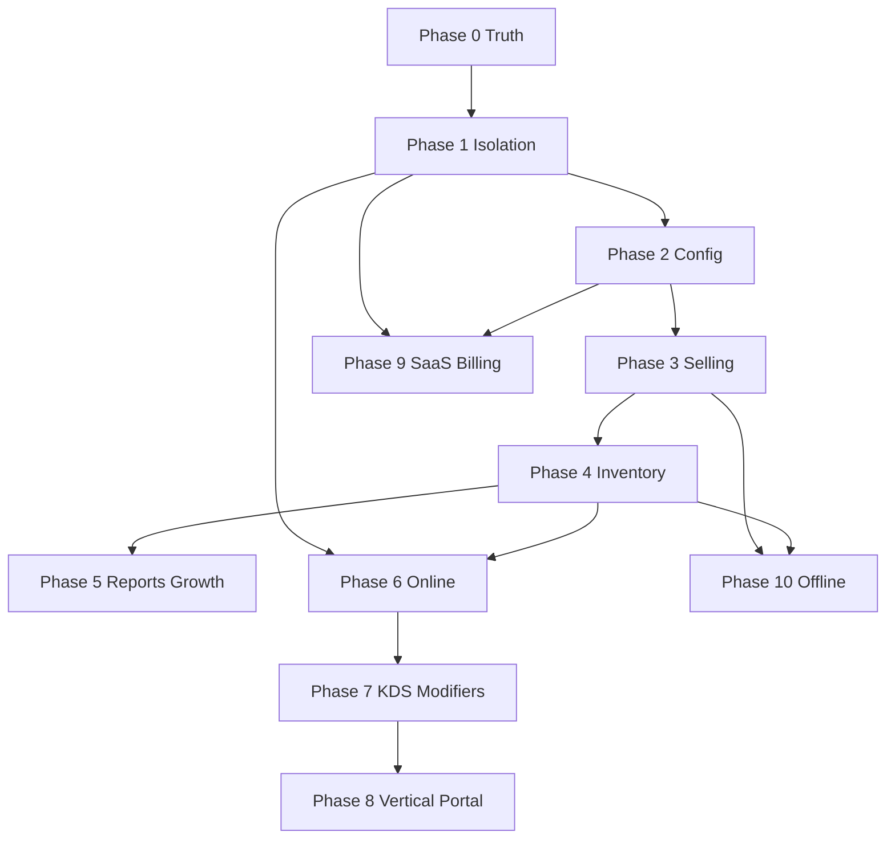

# Bassata POS — Master Architecture Plan

**Product names in repo:** Bassata OMS / SweetFlow / CafeFlow (`cafeflow-erp-pos`)  
**Status:** Canonical architecture — single source of truth for build-out  
**Date:** 2026-07-13  
**Audience:** Engineering, Product, Security  
**Rule:** One architecture per concern. No option menus. Corrections of current gaps are explicit ADRs.

**Related docs (operational, not superseded):**  
[MVP_FREEZE.md](./MVP_FREEZE.md) · [COMPLETION_PLAN.md](./COMPLETION_PLAN.md) · [PRODUCTION_PLAN.md](./PRODUCTION_PLAN.md) · [STABILIZATION_PLAN.md](./STABILIZATION_PLAN.md) · [FEATURE_FLAGS.md](./FEATURE_FLAGS.md) · [DEPLOYMENT.md](./DEPLOYMENT.md)

---

## 0. Executive verdict (after full codebase analysis)

Bassata is already a **multi-tenant POS + light ERP** on **Next.js App Router + Supabase (Postgres/Auth/Storage/RLS)** with money-critical logic in **Postgres RPCs**.

| Layer | Reality today | Verdict |
|-------|---------------|---------|
| Domain coverage | Strong: org→store→warehouse, catalog, recipes, sessions, checkout, AR/AP, inventory, online menu | Keep & harden |
| Tenancy | Shared DB + `org_id` + RLS (`auth_org_id`, `has_store_access`) | **Correct model** — harden, do not rewrite to DB-per-tenant |
| Config-by-activity | `business_activity` + feature flags + product templates | **Correct model** — complete UI & catalog visibility |
| Selling engine | Checkout in RPC; split pay; credit; sessions; vault | Keep RPC as source of truth |
| SaaS control plane | Migration `039` created platform tables; **`20260612193243` drops them**; no `/platform` in `src/` | **Defect** — must restore then build |
| Gaps (not invented) | Modifier catalog, KDS, tips, FX, table reservations, customer portal, offline sync, scale device registry, external accounting sync, realtime, queues | Phased after core hardening |

**Do not redesign the stack.** Correct isolation, finish configuration surface, close selling/inventory gaps, then SaaS lifecycle.

---

## 1. System context

```
┌─────────────────────────────────────────────────────────────────┐
│                     PLATFORM CONTROL PLANE                        │
│  invites · suspend/reactivate · tenant health · platform audit   │
│  (service_role only; no tenant data plane credentials)           │
└────────────────────────────┬────────────────────────────────────┘
                             │ provisions
                             ▼
┌─────────────────────────────────────────────────────────────────┐
│                     TENANT DATA PLANE (per org)                   │
│  settings · catalog · inventory · customers · suppliers · orders │
│  scoped by org_id + store_id + warehouse_id + RLS                │
└───────┬─────────────────┬──────────────────┬────────────────────┘
        │                 │                  │
   Admin Shell      Operational POS     Public surfaces
   (shell)          (device+session)    (/menu, online order)
```

**Surfaces (locked):**

| Surface | Route group | Users |
|---------|-------------|-------|
| Admin / ERP | `(shell)` | owner, manager, inventory |
| POS | `(operational)/pos` | cashier (+ paired device) |
| Auth / device / unlock | `(auth)` | all |
| Print | `(print)` | ops |
| Public menu | `/menu/[slug]` | customers (no login) |

---

## 2. Domain Model (canonical)

Ownership rule: **every operational row belongs to exactly one Organization**, either directly (`org_id`) or via `store_id → stores.org_id`.

### 2.1 Aggregate map

| Aggregate | Root | Children / related | Ownership |
|-----------|------|--------------------|-----------|
| Organization | `organizations` | `app_settings`, `stores`, `users`, catalog, suppliers, customers, loyalty_rules | Tenant root |
| Branch | `stores` | warehouses, devices, sessions, orders, expenses, online menu settings | Org |
| Warehouse | `warehouses` | stock_levels, batches, movements (via warehouse_id) | Store (+ org) |
| Device | `devices` | pairing codes, user_device_access | Store |
| User | `users` | pin_codes, user_store_access, user_device_access, user_permission_grants | Org |
| Customer | `customers` | customer_ledger, customer_payments, loyalty_ledger | Org |
| Supplier | `suppliers` | purchase_invoices, supplier_payments | Org |
| Product | `products` | variants, recipes, price_tiers, serials | Org |
| Variant | `product_variants` | weight/portion kinds | Product |
| Recipe | `product_recipes` + lines | costing / deduction | Org |
| Inventory | stock_levels, movements, batches | transfers, waste, counts | Store/Warehouse |
| Purchase | purchase_invoices + lines | landed cost | Store (via store; no org_id column today) |
| Sales / Order | orders + items + payments | deductions, loyalty | Store + session |
| Session | cashier_sessions | vault, expenses, orders | Store |
| Online order | online_orders + items | → may create POS order | Store |
| Expense | expenses | cost centers, categories | Store |
| Audit | audit_logs | append-only | Org |

### 2.2 Exists vs deferred (factual)

| Domain concept | Status | Architecture decision |
|----------------|--------|----------------------|
| Organization / Branch / Warehouse / Device / User | Exists | Keep |
| Customer / Supplier / AR / AP | Exists | Keep |
| Product / Variant / Recipe / Price tiers | Exists | Keep |
| Modifier **catalog** | **MISSING** (only `order_items.modifiers` JSONB) | Phase 6: introduce `modifier_groups` + `modifiers` when restaurant/cafe needs structured modifiers; until then JSONB line modifiers only for ad-hoc |
| Inventory / Purchase / Transfers / Waste / Count | Exists | Keep; complete FEFO posting paths |
| Sales / Payments / Sessions / Split / Credit | Exists | Keep RPC-centric |
| Taxes / Discounts | Exists (org settings + order discounts + flags) | Keep; promotions engine later as rules table |
| Loyalty | Exists (basic rules + ledger) | Keep; campaigns later |
| Kitchen / KDS | **MISSING** | Phase 7 |
| Delivery (first-party zones/fees) | Partial (online fulfillment fields; Souqna dropped) | Phase 6 first-party only |
| Tips | **MISSING** | Phase 7 if market requires |
| Exchange (FX) | **MISSING** | Out of Egypt MVP; single currency (EGP) locked in UI |
| Table reservations | **MISSING** | Phase 8 restaurant pack |
| Accounting integration (external GL) | **MISSING** (internal cost centers only) | Phase 9 export adapters |
| Reports | Exists (sales/inventory/expenses/profit hubs) | Keep; deepen in Phase 5 |
| Customer portal | **MISSING** | Phase 8 (order tracking page first, account later) |
| Offline sync tables | **MISSING** | Phase 10 only after online-stable |
| Scale device registry | **MISSING** (weight sale modes exist) | Config in store settings first; hardware registry later |

### 2.3 Identity & numbering

- Order numbers: `order_number_counters` per `(store_id, business_date)` — keep.
- Customer uniqueness: `(org_id, phone)` — keep.
- Store code uniqueness: partial unique per org — keep; extend global uniqueness for `online_menu_slug`.

---

## 3. Multi-Tenant Architecture (final)

### 3.1 Chosen model: Shared database, logical isolation (RLS)

**Decision:** One Supabase/Postgres project per environment (staging/prod), all tenants as rows, isolation via `org_id` + RLS + app defense-in-depth.

**Why this is the correct choice for Bassata (not DB-per-tenant):**

1. Matches Square / Shopify / Toast SaaS economics and ops (one schema, one migration train).
2. Already implemented (`auth_org_id()`, `has_store_access()`, feature triggers).
3. DB-per-tenant would explode ops cost and block shared catalog improvements; unjustified at current scale.
4. Schema-per-tenant adds migration complexity without meaningful security gain over correct RLS.

**Wrong alternative rejected:** Rewriting to separate Postgres per org.

### 3.2 Tenant boundaries

| Boundary | Definition |
|----------|------------|
| Tenant | One `organizations` row |
| Data plane | All rows reachable only if `org_id = auth_org_id()` or via store in that org |
| Store scope | Cashier/inventory ops further limited by `user_store_access` unless privileged role |
| Device scope | POS mutations require paired device cookie + store match |
| Public plane | Unauthenticated; discovers **one store menu** by slug/token; never lists tenants |
| Control plane | Platform admins; no tenant membership; service_role + platform tables only |

### 3.3 Isolation rules (complete)

1. **Session user** → `users.auth_user_id` → single `org_id` (enforce UNIQUE on `auth_user_id`).
2. **Never trust client-supplied `org_id`.** Derive via `getOrgId()` / `auth_org_id()`.
3. **RLS is mandatory** on every tenant table.
4. **`createAdminClient()` (service_role)** may only run in:
   - onboarding bootstrap (invite-gated)
   - platform control plane
   - public menu/order with **explicit store/org filters** and least-privilege queries
   - auth admin user provisioning inside an already-authorized org action
5. **Storage:** paths `{orgId}/…`; public assets under `{orgId}/public/…` only.
6. **Cross-tenant tests** are a release gate (see §13).

### 3.4 Security boundaries

| Boundary | Enforcement |
|----------|-------------|
| Edge | `src/proxy.ts` — auth session, public allowlist, device cookie for POS/sessions |
| App | `requireAuth` / `requirePermissionOrRole` / `requireFeature` / `requireStoreAccess` / `requirePosAccess` |
| DB | RLS + SECURITY DEFINER helpers + checkout/pairing RPCs |
| Secrets | Anon key public; service role + cookie secret server-only; never shared staging↔prod |
| Audit | Append-only `audit_logs`; platform actions in `platform_audit_logs` |

### 3.5 Data ownership

| Data | Owner | Shared? |
|------|-------|---------|
| Catalog, customers, suppliers, settings | Org | No |
| Stock, orders, sessions, devices | Store (within org) | No cross-org |
| Permissions catalog (`permissions`) | Platform (global read) | Yes — definition only |
| Auth emails | Global `auth.users` | One email → one app user membership (practical constraint) |
| Platform invites / admins | Control plane | Yes |

### 3.6 Control plane & platform administration

**Target (must fix migration defect first):**

| Capability | Mechanism |
|------------|-----------|
| Invite company | `platform_company_invites` + token; onboarding requires valid invite in production |
| Suspend / reactivate | `organizations.status`; already blocks login via `isOrganizationSuspended` |
| Tenant lookup / size | `platform_organization_data_size` (fix `purchase_invoices.org_id` bug — count via stores) |
| Platform admins | `platform_admins` + bootstrap emails env (wire in app) |
| Support access | Audited impersonation **only** after Phase 9; until then no impersonation |
| Billing | Phase 9 — Stripe (or Marketplace) subscriptions; plan limits as settings, not schema forks |

**Critical defect to correct (ADR-001):**  
`039_platform_admin_console.sql` creates platform tables; `20260612193243_cafeflow_legacy_cleanup.sql` **drops them**. Net schema after full migration train: **platform tables absent**. New migration must re-create platform console objects **after** cleanup, then build `/platform` UI.

---

## 4. Permission Architecture (final)

### 4.1 Model: RBAC + optional grants + feature flags + store ACL + device ACL

```
User
 ├─ role (owner | manager | cashier | inventory)
 ├─ role_permissions (org-scoped matrix)
 ├─ user_permission_grants (overrides)
 ├─ user_store_access
 └─ user_device_access
Feature flags (org app_settings) gate modules independently of RBAC.
```

**Why not pure ABAC / ReBAC:** Overkill for café/retail POS; current model matches Toast/Lightspeed staff model.

### 4.2 Roles (canonical)

| Role | Intent |
|------|--------|
| `owner` | Full org; always passes `requirePermissionOrRole` |
| `manager` | Ops + overrides + most mutations |
| `cashier` | POS + limited session |
| `inventory` | Stock/purchases/transfers/counts |

Remove dead `viewer` from product language (enum may remain in DB historically).

### 4.3 Permission matrix (product rule)

- Single catalog: align `src/lib/constants.ts` `PERMISSIONS` with DB `permissions` / `015` seeds.
- Drop or implement orphans (`monthly_closing_*` until period lock returns; wire `online_order_manage` or map online staff actions to it).
- Page access: `PATH_PERMISSIONS` + `AccessDenied` (never empty page).
- Nav: `nav.ts` filters by permission **and** feature flag.

### 4.4 Policies & RLS

| Pattern | Use |
|---------|-----|
| `org_id = auth_org_id()` | Org entities |
| `has_store_access(store_id)` | Store entities |
| Both from/to store access | Transfers |
| `has_permission(key)` | Fine-grained where role insufficient |
| `is_feature_enabled(flag)` triggers | Module kill-switch at DB |
| Deny update/delete on `audit_logs` | Append-only |

### 4.5 Store / branch / warehouse access

| Level | Rule |
|-------|------|
| Branch (store) | Explicit ACL except owner/manager |
| Warehouse | Belongs to store; access = store access; default warehouse per store |
| Active store cookie | Validate membership every request; **sign cookie** like device cookie (ADR-002) |

### 4.6 Audit

- All money, stock, permission, settings, force-close, manager override → `writeAuditLog` / `insert_audit_log`.
- Platform actions → `platform_audit_logs`.
- No silent admin inserts except documented bootstrap path.

---

## 5. Business Configuration (activity = config, not schema)

### 5.1 Principle

**One schema for all industries.** Activity type selects presets that flip:

- `app_settings.business_activity`
- `app_settings.feature_flags`
- `app_settings.product_templates`
- Module visibility in nav/POS
- Default inventory tracking / rotation / expiry policies

**Never** create `restaurant_*` tables or per-industry databases.

### 5.2 Activity catalog (canonical product list)

Map market names → internal `business_activity_type` (+ presets):

| Market label | Internal activity | Notes |
|--------------|-------------------|-------|
| Cafe | `cafe` | Exists |
| Ice cream / dessert | `ice_cream` | Exists |
| Juice bar | `juice_bar` | Exists |
| Restaurant | `restaurant` | Exists; modifiers/KDS later phases |
| Bakery | `cafe` or `restaurant` preset variant | Prefer new preset key `bakery` **only if** enum extended in migration (confirm before add) |
| Supermarket | `supermarket` | Exists; weight sales |
| Retail | `retail` (DB enum) | Align app constants with DB |
| Wholesale | `wholesale` / sales_mode wholesale | Config via `enabled_sales_modes` |
| Pharmacy | Preset on `supermarket`/`retail` + expiry FEFO strict | No drug-specific schema in v1 |
| Electronics | Preset + serial tracking flags | Uses existing serial foundations |
| Fashion | Preset + variants strong | Uses variants |

**App must expose Settings → Activity** (actions already exist; UI missing).

### 5.3 Module activation matrix (by flags + activity)

| Module | Gate |
|--------|------|
| Recipes | `recipes` + activity default |
| Variants | `business_activity.enable_variants` |
| Weight / amount sales | activity flags + checkout RPC |
| Purchases / transfers / waste / stock count | feature flags + DB triggers |
| Loyalty / credit / refunds | feature flags |
| Online menu / orders | store settings + flags (align constants) |
| Wholesale path | `enabled_sales_modes` includes wholesale |
| Barcode / receipt / drawer | POS operational flags |

Changing activity applies preset with explicit owner confirmation (destructive to defaults, not to historical orders).

---

## 6. Selling Engine (final design)

### 6.1 Source of truth

**Postgres RPC checkout** (`complete_checkout`, `complete_checkout_split`, expired-session overrides) is the **only** path that creates paid orders and stock deductions.

App layer: validate UX, build payload, call RPC, handle errors, print receipt.

**Rejected:** Moving price/tax/stock math exclusively to TypeScript (drift + bypass risk).

### 6.2 Engine breakdown

| Engine | Current | Target behavior |
|--------|---------|-----------------|
| Pricing | Base price, variants, wholesale tiers, weight calc | Keep in RPC + price_tiers; document algorithm |
| Discount | Order-level + manager override + bounds CHECK | Keep; product-level discounts Phase 5 |
| Tax | Org tax settings + flag `tax` | Keep inclusive/exclusive policy |
| Promotion | **MISSING** as engine | Phase 5: `promotion_rules` table; evaluate in RPC |
| Returns / Refunds | Order status refunded + flag | Keep; restock policy explicit in RPC |
| Exchange (goods) | **MISSING** | Phase 5: return+new sale linked, not FX |
| Split payments | `order_payments` multi-row | Keep; finish partial credit split |
| Tips | **MISSING** | Phase 7 optional line/payment component |
| Cash drawer | Flag + ESC/POS kick | Keep hardware optional |
| Sessions | Open/close/force-close + vault | Keep lifecycle locks |
| Receipts | Format service + print routes | Keep store branding |
| Hold/park | Client Zustand | Phase 4: persist held carts server-side for device switch |
| Offline | **MISSING** | Phase 10 only |

### 6.3 POS day flow (canonical)

1. Pair device → cookie  
2. Login / PIN cashier  
3. Open session (+ vault float)  
4. Sell (retail/wholesale/weight as configured)  
5. Pay (cash/card/wallet/other/credit/split)  
6. Receipt / drawer  
7. Session expenses (if flag)  
8. Close session + reconciliation  

---

## 7. Inventory Engine (final design)

### 7.1 Model

- **Stock on hand:** `stock_levels` per warehouse × product × variant  
- **Ledger:** `inventory_movements` (immutable enough for audit; corrections via adjustments)  
- **Batches:** `inventory_batches` + `inventory_batch_movements` (036)  
- **Serials:** `product_serial_numbers` when enabled  
- **Units:** `inventory_units` + `unit_conversions`

### 7.2 Policies

| Policy | Mechanism |
|--------|-----------|
| Negative stock | Flag `prevent_negative_stock` + RPC; allow path exists in migrations — product default per org |
| FIFO / FEFO | `inventory_rotation_method` on activity/product; batch pick order in deduction |
| Average cost | Maintain weighted average on receive/sale (recipe costing + purchase landed cost) |
| Reservations | Movement types exist; use for online accept → hold stock; release on cancel |
| Cycle count | `stock_counts` → post adjustments; **add approval step** before post (Phase 4) |
| Transfers | Ship/receive with dual-store ACL |
| Waste | Record + movement |

### 7.3 Deduction on sale

Finished goods: decrement stock.  
Recipe products: explode recipe lines → ingredient deductions (`order_item_deductions`).

---

## 8. Online Ordering (final design)

### 8.1 Surfaces

| Surface | Auth | Data access |
|---------|------|-------------|
| QR / online menu | Public | Admin client **scoped** by store slug or token |
| Place online order | Public | Same + rate limit |
| Staff fulfillment | Authenticated | Store ACL + permission |
| Customer tracking page | Public tokenized link | Phase 6 |
| Customer account portal | Auth customer | Phase 8 |

### 8.2 Menu privacy (canonical)

1. Catalog remains org-owned.  
2. **Visibility flag per product** (requires confirmed column/migration): `show_on_online_menu` (default false for raw materials, true for finished as seed rule).  
3. Public query returns only visible + active finished products.  
4. Modes: **Public slug** vs **Unlisted token** (`online_menu_token` already stored — wire it).  
5. **Global unique** `online_menu_slug`.  

### 8.3 Fulfillment

- Pickup / delivery as online order fields (first-party).  
- Hours & availability windows (Phase 6).  
- Delivery zones/fees (Phase 6).  
- Souqna: **do not resurrect** unless product re-approves; cleanup removed it intentionally.

---

## 9. Device Architecture (final design)

### 9.1 Device classes

| Device | Support | Mechanism |
|--------|---------|-----------|
| POS browser (Win/mac/Android tablet) | Required | Paired `devices` + cookies |
| iPad | Best-effort | Same web POS |
| Barcode scanner | HID keyboard wedge | Flag `barcode_scanner` |
| Receipt printer | USB / browser print | Flag + print routes |
| Cash drawer | Via printer kick | Flag |
| Customer display | Phase 7 | Second window / HDMI — not in schema yet |
| Scale | Weight modes in software; USB scale Phase 7 | No fake hardware layer now |
| Kitchen screen | Phase 7 | Realtime tickets |
| Mobile POS | Same web app responsive | No native app in plan |

### 9.2 Security

- Pairing codes short-lived, rate-limited (`025`).  
- Signed device + cashier cookies.  
- Sign store cookie (ADR-002).  
- Cashier device ACL via `user_device_access` / `cashier_can_use_device`.

### 9.3 Offline sync

**Out of MVP.** When built (Phase 10): local outbox → idempotent RPC replay → conflict policy = server wins for stock. Do not start PWA until online path is stable (matches MVP_FREEZE).

---

## 10. SaaS Platform (final design)

| Capability | Phase | Notes |
|------------|-------|-------|
| Multi-org onboarding | Now / Phase 1 | Invite-gated in production |
| Feature flags per org | Exists | Align lists |
| Platform dashboard | Phase 1–2 | After ADR-001 restore |
| Invitations | Phase 1 | Use restored invites table |
| Suspend / reactivate | Phase 1 | Status already in org |
| Monitoring / audit | Phase 2–3 | Platform audit + app audit |
| Plans / billing / limits | Phase 9 | After pilot revenue model |
| Provisioning automation | Phase 9 | Invite + seed + limits |
| Backups | Infra Phase 3 | Supabase PITR prod |
| Impersonation | Phase 9 | Audited only |
| Export / delete tenant | Phase 9 | Legal + technical |

---

## 11. API Architecture (final design)

### 11.1 Chosen style (polyglot, intentional)

| Kind | Use |
|------|-----|
| **Server Actions** | Admin/ERP mutations (default) |
| **Route Handlers REST** | POS hot path (`/api/pos/*`) for stable clients & lower action overhead |
| **Postgres RPC** | Money, stock, pairing, permissions, audit insert |
| **Realtime** | Phase 6–7: online order board + KDS only |
| **Background jobs** | Phase 6+: imports, exports, email — start with Vercel cron / Workflow; no queue product until volume needs it |
| **Webhooks outbound** | Phase 9 integrations |
| **Caching** | React `cache()` for session/org; `revalidatePath` after mutations; no second cache bus |
| **Rate limiting** | Public menu/order + pairing (DB + edge); platform APIs later |

**Rejected:** Separate Nest/Express API service (duplicates auth/RLS, slows team).  
**Rejected:** GraphQL layer for v1.

### 11.2 Events (internal)

Until a bus exists: **audit_logs + domain status columns** are the event source. Optional `domain_events` outbox only when realtime/webhooks require it (Phase 7+).

---

## 12. Database Architecture (final design)

### 12.1 Principles

- Single schema `public` + Supabase Auth.  
- Migrations only via `supabase/migrations` — never invent columns in app.  
- Regenerate `database.types.ts` after every schema change (`npm run db:types`).  
- Soft lifecycle: `is_active` / status / `voided_at` — do not introduce parallel `deleted_at` without migration plan.

### 12.2 Integrity fixes required

| Issue | Action |
|-------|--------|
| Platform tables dropped by cleanup | Re-create after cleanup (ADR-001) |
| `users.auth_user_id` not UNIQUE | Add UNIQUE (ADR-003) |
| `online_menu_slug` not globally unique | Unique index/expression (ADR-004) |
| `purchase_invoices` counted by `org_id` in platform RPC | Fix RPC to join stores |
| App `FEATURE_FLAGS` vs DB flags drift | Single source list |
| Hand-written types incomplete | Always generate from DB |

### 12.3 Indexes & performance

- Keep existing store/time indexes on orders, sessions, movements, audit.  
- Add indexes only with measured queries (reports, menu slug lookup).  
- **No partitioning** until orders volume justifies (millions/store-month).  
- **No pg_trgm** until search UX requires; start with `ilike` + indexes on sku/barcode/phone.

### 12.4 Search

v1: repository filters.  
v2: optional generated `search_vector` if needed — not before pilot.

---

## 13. Frontend Architecture (final design)

### 13.1 Structure (keep)

```
src/app/(shell|operational|auth|print)/   thin routes
src/modules/<domain>/{actions,services,components,schemas}
src/lib/{auth,repositories,services,supabase}
src/stores/   zustand (pos, auth UI, shell UI)
src/components/SweetFlow/ + components/ui/
```

### 13.2 Rules

- Arabic-first RTL; SweetFlow design system only ([DESIGN_SYSTEM.md](./DESIGN_SYSTEM.md)).  
- Forms: RHF + Zod.  
- Server Components by default; client for POS interactivity.  
- States: loading / empty / error / success on every page.  
- Fix DESIGN_SYSTEM path casing doc drift (`SweetFlow` vs `sweetflow`).

### 13.3 State

- Server = source of truth for money/stock.  
- Zustand = POS cart UX only until held carts persist.  
- No Redux. No duplicate React Query cache unless POS latency demands (optional later).

### 13.4 Theme

- Feature flag `dark_mode`; CSS variables per design system.

---

## 14. Testing Strategy (final)

| Layer | Scope | Gate |
|-------|-------|------|
| Unit (Vitest) | Pricing helpers, mappers, pure services | CI `smoke:check` |
| Integration | RPC checkout, RLS policies scripts | `verify:*` |
| E2E (Playwright) | Login → session → sale → close | Manual + workflow_dispatch → then CI on main |
| Cross-tenant | Org A token cannot read Org B | **Mandatory** before multi-tenant prod |
| Security | Pairing, service_role paths, public menu filters | `verify:p0-security`, `verify:rls-policies` |
| Performance | Checkout budget ([PERFORMANCE_BUDGET.md](./PERFORMANCE_BUDGET.md)) | Pilot |
| Load | k6/Artillery on checkout RPC | Pre-scale (Phase 8+) |

---

## 15. Deployment (final)

| Env | Supabase | App | Secrets |
|-----|----------|-----|---------|
| Dev | Local / shared dev project | `npm run dev` | `.env.local` |
| Staging | Dedicated project | Vercel preview/staging domain | Distinct cookie secret + service role |
| Production | Dedicated + PITR | Vercel prod | Distinct secrets; invite-only onboarding |

**CI/CD:** GitHub `quality-gate` on PR; deploy via Vercel; migrations `supabase db push` per env with checklist.  
**Rollback:** Vercel instant rollback + DB forward-fix migrations only (no destructive down).  
**Monitoring:** error tracking (Phase 3), logs, ERROR_BUDGET.  
**Backups:** Supabase PITR + restore drill documented.

Align [DEPLOYMENT.md](./DEPLOYMENT.md) with reality (remove live Souqna/platform claims until restored).

---

# 16. Phased Roadmap (strict sequence)

**Rule:** Do not start Phase N+1 until Phase N Definition of Done is met.

Complexity: S ≤ 1 wk · M 1–2 wk · L 2–4 wk · XL 4+ wk (1–2 engineers).  
Durations assume focused work after Pilot freeze decisions.

---

## Phase 0 — Truth & Freeze Alignment

**Objective:** Align docs/code; stop building on false assumptions.  
**Why:** Platform tables “exist in 039” but are dropped; README/DEPLOYMENT drift; freeze vs SaaS scope conflict.  
**Dependencies:** None.  
**Estimated complexity / duration:** S / 2–3 days  

**Tasks:**
- Document ADR-001…004 in this file (done below).
- Inventory migration net state on staging/prod (`platform_*` presence).
- Mark MVP_FREEZE vs this plan: Phase 0–3 security may proceed as P0; SaaS billing stays post-pilot.
- Fix doc drift (Souqna, `/platform`, monthly closing).

**Deliverables:** Migration audit note; updated DEPLOYMENT references; team agreement on phase order.  

**Risks:** Shipping SaaS UI against missing tables.  

**Definition of Done:**
- [ ] Staging DB inspected for `platform_*` and online menu tables  
- [ ] Docs that claim `/platform` or Souqna marked accurate  
- [ ] This Master Architecture accepted as canonical  

---

## Phase 1 — Tenant Isolation Hardening (P0)

**Objective:** Real logical isolation + safe provisioning.  
**Why:** Open onboarding + service_role public paths + dropped control plane = SaaS risk.  
**Dependencies:** Phase 0.  
**Estimated complexity / duration:** L / 2–3 weeks  

**Tasks:**
1. Migration: restore platform tables **after** cleanup (ADR-001).  
2. Production onboarding requires invite token.  
3. Wire `/platform` minimal: list orgs, suspend/reactivate, create invite, audit.  
4. Defense-in-depth `org_id`/`store_id` on every admin-client query.  
5. Online menu: slug unique; token unlisted mode; filter finished+visible only (visibility column if approved).  
6. Sign `sf_active_store` (ADR-002).  
7. UNIQUE `users.auth_user_id` (ADR-003).  
8. Cross-tenant automated tests.  
9. Align feature flag constants with DB.

**Deliverables:** Migrations; platform UI; invite onboarding; tests; hardened menu service.  

**Risks:** Breaking existing demo onboarding; slug collisions on unique index backfill.  

**Definition of Done:**
- [x] Cannot create org in prod without invite  
- [x] Org A session fails all Org B reads in tests  
- [x] Suspended org cannot login  
- [x] Public menu cannot return other org’s products  
- [x] `verify:rls-policies` + new cross-tenant suite green  

**Acceptance criteria:** Security review of service_role call sites passes.

---

## Phase 2 — Business Configuration Complete

**Objective:** Activity & selling config fully operable without schema forks.  
**Why:** Presets exist; Settings UI incomplete; activity not operable post-onboarding.  
**Dependencies:** Phase 1.  
**Estimated complexity / duration:** M / 1–2 weeks  

**Tasks:**
- Settings tab: Activity (presets, sales modes, weight/wholesale, inventory defaults).  
- Settings: unify payments, tax, receipt, session, online menu toggles.  
- Onboarding maps 1:1 to same settings model.  
- Module nav reacts to flags + activity.  
- Expand presets for retail/wholesale/pharmacy/electronics/fashion **as config only** (enum changes need migration approval).

**Deliverables:** Activity settings UI; docs for operators; preset matrix.  

**Risks:** Changing activity mid-flight confuses stock policies — require confirm dialog.  

**Definition of Done:**
- [x] Owner can change activity and see POS/nav behavior change  
- [x] No industry-specific tables added  
- [x] Onboarding ↔ settings parity  

---

## Phase 3 — Selling Engine Completion (online-first POS)

**Objective:** Close money-path gaps for pilot-grade POS.  
**Why:** Core RPC exists; partial credit split, persisted holds, refund restock clarity remain.  
**Dependencies:** Phase 2.  
**Estimated complexity / duration:** L / 2–3 weeks  

**Tasks:**
- Finish split + partial credit per COMPLETION_PLAN.  
- Refund/restock policy documented and enforced in RPC.  
- Persist held carts server-side (store+device scoped).  
- Manager override audit coverage complete.  
- Receipt branding completeness.  
- E2E: open → sell → split → refund → close.

**Deliverables:** RPC updates; POS UX; E2E green.  

**Risks:** Checkout performance regression — measure against PERFORMANCE_BUDGET.  

**Definition of Done:**
- [ ] Full cashier E2E passes on staging — residual after S10 (gated Playwright; not executed without staging/auth)
- [x] No checkout math in client-only path  
- [x] Audit rows for overrides/refunds/force-close  
- [x] Persisted holds (store+device) — S10 `pos_held_carts`  

---

## Phase 4 — Inventory Engine Hardening

**Objective:** Reliable stock truth for café/dessert/supermarket presets.  
**Why:** Foundations (036) exist; posting paths / approval / FEFO need productization.  
**Dependencies:** Phase 3 (sales deductions stable).  
**Estimated complexity / duration:** L / 2–3 weeks  

**Tasks:**
- FEFO/FIFO batch consumption on sale when batch tracking on.  
- Stock count approval before post.  
- Reservation on online accept.  
- Negative stock policy UX clear.  
- Reorder/expiry alerts stable.  
- Fix any movement/ledger inconsistencies found in verify scripts.

**Deliverables:** Inventory policy docs; RPC/service updates; tests.  

**Definition of Done:**
- [ ] Batch-tracked product sale consumes correct batch  
- [ ] Count cannot post without approval when enabled  
- [ ] `verify:inventory-crud` green  

---

## Phase 5 — Reports & Commercial Growth

**Objective:** Owner trust numbers; light promotions/discounts.  
**Why:** Report hubs exist; aging/P&L/promotions incomplete.  
**Dependencies:** Phase 4.  
**Estimated complexity / duration:** L / 3 weeks  

**Tasks:**
- Daily close report; customer/supplier aging; tax export basics.  
- Product-level discount + promotion_rules (simple).  
- Loyalty rule flexibility (amount/category) without new product surface sprawl.  

**Definition of Done:**
- [ ] Owner can explain day cash from report alone  
- [ ] Promotion applies only via server/RPC  

---

## Phase 6 — Online Ordering Productization

**Objective:** First-party QR menu + ordering trustworthy.  
**Why:** Menu/orders restored; privacy/availability/hours incomplete.  
**Dependencies:** Phase 1 (isolation) + Phase 4 (reservations).  
**Estimated complexity / duration:** L / 2–3 weeks  

**Tasks:**
- Product visibility + hours + pickup/delivery + fees/zones.  
- Staff board (+ optional Realtime).  
- Tokenized customer order status page.  
- Rate limits / abuse controls.

**Definition of Done:**
- [ ] Hidden products never appear publicly  
- [ ] Order tracking works without login  
- [ ] Cross-tenant menu tests remain green  

---

## Phase 7 — Kitchen, Modifiers, Devices Expansion

**Objective:** Restaurant/cafe depth without schema fork.  
**Why:** JSONB modifiers insufficient for structured menus; no KDS.  
**Dependencies:** Phase 6.  
**Estimated complexity / duration:** XL / 4+ weeks  

**Tasks:**
- Modifier groups/modifiers catalog + POS UI.  
- KDS tickets via Realtime.  
- Tips (if required).  
- Customer display / scale integration hooks.  

**Definition of Done:**
- [ ] Modifier changes reflected on receipt and costing  
- [ ] KDS receives tickets within budget latency  

---

## Phase 8 — Restaurant Pack & Customer Portal (optional vertical)

**Objective:** Tables/reservations/portal only if product commits.  
**Dependencies:** Phase 7.  
**Estimated complexity / duration:** XL  

**Tasks:** Floor/tables, reservations, customer accounts.  
**Definition of Done:** Defined only after product yes/no gate.

---

## Phase 9 — SaaS Commercialization

**Objective:** Billable multi-tenant business.  
**Dependencies:** Phase 1–2 stable in production.  
**Estimated complexity / duration:** XL  

**Tasks:** Plans, Stripe/Marketplace billing, limits (stores/devices/users/flags), export/delete, audited impersonation.  

**Definition of Done:**
- [ ] Suspend for non-payment works  
- [ ] Plan limit enforced server-side  
- [ ] Tenant export completes  

---

## Phase 10 — Offline / Mobile Hardening

**Objective:** Intermittent network stores.  
**Dependencies:** Phases 3–4 rock solid.  
**Estimated complexity / duration:** XL  

**Tasks:** Outbox, idempotent replay, conflict policy, optional PWA.  
**Definition of Done:** Sale survives airplane mode for N minutes with zero double-charge.

---

# 17. Master Checklist

### Isolation
- [x] Invite-only prod onboarding
- [x] Platform tables present post-cleanup
- [x] `/platform` suspend/invite/audit
- [x] Cross-tenant tests
- [x] Signed store cookie
- [x] UNIQUE auth_user_id
- [x] Unique menu slug
- [x] Menu visibility filter
- [x] service_role call-site review

### Configuration
- [ ] Activity settings UI  
- [ ] Preset matrix for target verticals  
- [x] Flag constant parity  
- [ ] Onboarding ↔ settings parity  

### Selling
- [x] Split/credit complete  
- [x] Refund restock policy  
- [x] Persisted holds  
- [ ] Cashier E2E  

### Inventory
- [ ] FEFO/FIFO on sale  
- [ ] Count approval  
- [ ] Online stock reservation  

### Online
- [ ] Hours / availability  
- [ ] Pickup/delivery fees  
- [ ] Tracking page  

### Platform
- [ ] Billing/plans  
- [ ] Export/delete  
- [ ] Monitoring/PITR  

### Quality
- [ ] CI quality-gate  
- [ ] Staging smoke  
- [ ] Pilot device matrix  
- [ ] Docs match code  

---

# 18. Dependency Graph



**Hard gates:** P1 before any public multi-tenant scale; P3 before Pilot expansion; P4 before trusting inventory financials; P9 only after paying customers demand.

---

# 19. Risk Matrix

| ID | Risk | Likelihood | Impact | Mitigation | Owner phase |
|----|------|------------|--------|------------|-------------|
| R1 | service_role bug leaks cross-tenant | M | Critical | Least-privilege queries + tests | P1 |
| R2 | Platform tables missing in prod | H | High | ADR-001 migration | P0–P1 |
| R3 | Open onboarding abuse | H | High | Invite gate | P1 |
| R4 | Menu slug collision | M | High | Global unique + token mode | P1 |
| R5 | Checkout regression | M | Critical | RPC tests + perf budget | P3 |
| R6 | Stock drift FEFO incomplete | M | High | Batch tests | P4 |
| R7 | Scope creep (offline/KDS early) | H | High | Strict phase order | All |
| R8 | Doc/code drift | H | Med | Phase 0 + CI doc checks optional | P0 |
| R9 | Cookie secret fallback to service role | M | High | Enforce SweetFlow_COOKIE_SECRET in prod | P1 |
| R10 | Billing before isolation | L | Critical | P9 depends P1 | P9 |

---

# 20. Architecture Decision Records (ADR)

## ADR-001 — Restore platform control plane after cleanup

- **Status:** Accepted  
- **Context:** `039` creates `platform_*`; `20260612193243` drops them. App has no `/platform`.  
- **Decision:** Add a new dated migration that re-creates platform tables/RPCs (idempotent) **and** build minimal platform UI. Do not remove cleanup migration (history).  
- **Consequences:** Control plane becomes real; onboarding can require invites.

## ADR-002 — Sign active store cookie

- **Status:** Accepted  
- **Context:** Device/cashier cookies HMAC-signed; `sf_active_store` is plain UUID.  
- **Decision:** Sign/verify store cookie with same secret scheme; still re-validate store∈org on every use.  
- **Consequences:** Harder cookie tampering; migration of existing cookies (re-set on next store switch).

## ADR-003 — UNIQUE `users.auth_user_id`

- **Status:** Accepted  
- **Context:** `auth_org_id()` uses `LIMIT 1` without uniqueness.  
- **Decision:** Enforce UNIQUE where not null; clean duplicates before constrain.  
- **Consequences:** One auth identity → one app user row.

## ADR-004 — Globally unique online menu slug + token unlisted mode

- **Status:** Accepted  
- **Context:** Slug discovery via service_role; uniqueness only weakly enforced; token unused.  
- **Decision:** Unique slug across stores; support `?token=` or path token for unlisted menus.  
- **Consequences:** Requires backfill/rename on collisions.

## ADR-005 — Shared DB logical multi-tenancy

- **Status:** Accepted  
- **Context:** Need isolation for SaaS.  
- **Decision:** Shared Postgres + RLS + org_id; not DB-per-tenant.  
- **Consequences:** Security depends on RLS + admin-path discipline.

## ADR-006 — Activity is configuration, not schema

- **Status:** Accepted  
- **Context:** Multiple verticals requested.  
- **Decision:** One schema; presets/flags/templates per activity.  
- **Consequences:** Vertical features (KDS, modifiers) are modules gated by config, added in later phases as shared tables.

## ADR-007 — Money paths stay in Postgres RPC

- **Status:** Accepted  
- **Context:** Checkout must be consistent under concurrency.  
- **Decision:** All paid checkout/refund stock mutations via RPC.  
- **Consequences:** App cannot “fix” money in TS alone; RPC tests mandatory.

## ADR-008 — Offline deferred

- **Status:** Accepted  
- **Context:** MVP_FREEZE excludes offline; complexity high.  
- **Decision:** Phase 10 only after online POS/inventory stable.  
- **Consequences:** Pilot requires reliable network.

## ADR-009 — No Souqna resurrection by default

- **Status:** Accepted  
- **Context:** Cleanup dropped Souqna; docs still mention.  
- **Decision:** First-party online ordering only unless product reopens marketplace scope.  
- **Consequences:** Simpler public attack surface.

## ADR-010 — API = Server Actions + POS REST + RPC

- **Status:** Accepted  
- **Context:** Temptation to add separate API gateway.  
- **Decision:** Keep Next.js as BFF; RPC for money; REST only for POS hot paths.  
- **Consequences:** One deployable; clearer auth story.

---

# 21. Corrections of current architecture mistakes

| Mistake | Correction |
|---------|------------|
| Treating platform as “done” because `039` exists | Net migrations drop it → ADR-001 |
| Open `/onboarding` in multi-tenant SaaS | Invite gate in production |
| Public menu = all active products | Visibility + finished-only |
| Unsigned store cookie | ADR-002 |
| Industry thought as “different DB” | ADR-006 |
| Building offline/KDS before isolation | Phase order |
| Doc claims of Souqna/platform live | Phase 0 doc repair |
| `purchase_invoices.org_id` in platform size RPC | Join via stores |

---

# 22. How to use this document

1. **Pilot now:** Execute Phase 0 → 1 (security) in parallel with existing MVP freeze ops; do not skip isolation if accepting multiple orgs.  
2. **New features:** Must map to a Phase; if not listed, amend this doc first (ADR).  
3. **Schema changes:** Propose migration + update §2/§12 + regenerate types — never invent in PR description only.  
4. **Conflict with MVP_FREEZE:** Freeze wins for product features; **P0 security (Phase 1) is allowed** as hardening.

---

*End of Master Architecture Plan.*
