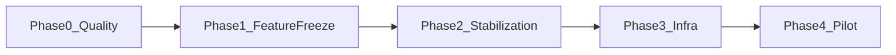

# خطة التنفيذ المتوازي — SweetFlow إلى الإنتاج

Source of truth for phased delivery. Supersedes the old “smoke-first” cutover order in [PRODUCTION_PLAN.md](./PRODUCTION_PLAN.md) until Feature Freeze.

## Assumptions

- Current phase: **0 — Product Quality** (shell + auth + settings + menu Meridian pass in progress / largely applied)
- Smoke / Staging / SMTP deferred until after Feature Freeze
- **Offline is out of MVP** (no PWA before Pilot)
- Meridian tokens (`--mds-*`) via existing SweetFlow components — no second design system
- Phase 0 ships in waves: Foundation + POS, then ops hot screens, then inventory/catalog

## Parallel ownership (multitask)

| Lane | Owns | Must not touch |
|------|------|----------------|
| **A — Design System / Shell** | `src/components/SweetFlow/*`, `src/components/layout/*`, shell layouts, CSS tokens | feature modules |
| **B — POS** | `src/modules/pos/**` | layout / SweetFlow primitives (consume only) |
| **C — Ops** | sessions, orders, expenses, dashboard | POS / layout |
| **D — Inventory & catalog** | inventory, products, purchases, suppliers, transfers, stock-count, waste | POS |
| **E — Docs & gates** | `docs/*` criteria, budgets, checklists | product code |

Merge A first in each wave; B/C/D consume updated primitives.

## Phase 0 — Product Quality

### Wave 0.1 — Foundation (A + E)

- Page shell via `PageHeader`, `OperationalCard`, `DataTableShell`
- `state-blocks` as sole Empty / Loading / Error source
- Chrome: app-shell, header, sidebar, mobile-nav, session-bar, command-palette
- Keyboard: command palette + POS shortcuts documented
- Responsive breakpoints: 768 / 1024 / 1280 on shell

Exit: primitives used in shell; gate docs present; MVP scope unchanged.

### Wave 0.2 — POS (B)

`pos-screen`, cart, payment, tiles, dialogs, receipt print — UI consistency, touch targets, states, error paths, performance budgets.

### Wave 0.3 — Ops (C)

Dashboard, sessions, orders, expenses — PageHeader + state-blocks + responsive + clear primary action.

### Wave 0.4 — Inventory & catalog (D)

Inventory hub, products, purchases, suppliers, transfers, stock-count, waste — same quality bar, no new features.

Exit Phase 0: daily MVP screens consistent with Meridian/SweetFlow; acceptance criteria per screen group.

## Phase 1 — Feature Complete + Freeze

See [MVP_FREEZE.md](./MVP_FREEZE.md). No new features until after Pilot except P0 bugfixes.

## Phase 2 — Stabilization

Only after freeze: [SMOKE_TEST.md](./SMOKE_TEST.md), `npm run verify:production`, permissions, sessions, refunds, reports, RLS.

Track automated results in [STABILIZATION_STATUS.md](./STABILIZATION_STATUS.md).

## Phase 3 — Infrastructure

Staging, SMTP, backups/PITR, monitoring, domain/SSL — [GO_LIVE_CHECKLIST.md](./GO_LIVE_CHECKLIST.md) · [PILOT_RUNBOOK.md](./PILOT_RUNBOOK.md).

## Phase 4 — Pilot

One branch, 3–7 days, collect notes, fix P0/P1, then expand. Validate [DEVICE_MATRIX.md](./DEVICE_MATRIX.md) on pilot hardware. Runbook: [PILOT_RUNBOOK.md](./PILOT_RUNBOOK.md).

## Gate documents

| Doc | Purpose |
|-----|---------|
| [ACCEPTANCE_CRITERIA.md](./ACCEPTANCE_CRITERIA.md) | When a screen is “done” |
| [PERFORMANCE_BUDGET.md](./PERFORMANCE_BUDGET.md) | Measurable UI latency targets |
| [ERROR_BUDGET.md](./ERROR_BUDGET.md) | Failure UX contracts |
| [DEVICE_MATRIX.md](./DEVICE_MATRIX.md) | Target hardware |
| [MVP_FREEZE.md](./MVP_FREEZE.md) | IN/OUT scope seal |
| [PILOT_RUNBOOK.md](./PILOT_RUNBOOK.md) | Infra + one-branch pilot |

During Phase 0 waves: selective per-screen checks only — not full smoke.
